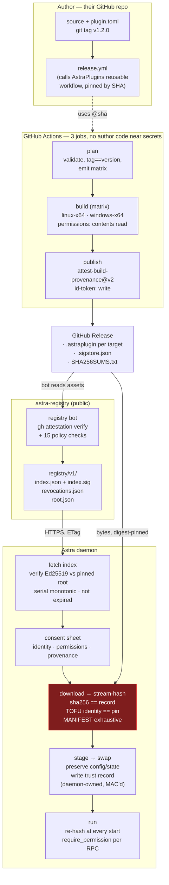

# Astra Plugin System — Production Plan

**Status:** authoritative. Supersedes `docs/en/publishing.md`, `docs/en/getting-started.md` and the
four design drafts. Where a design draft and this document disagree, this document wins.

**Repos.** Three, and commits never mix:

| Tag | Repo | Path on this machine |
|---|---|---|
| `[AP]` | `mihailinl/AstraPlugins` | `/home/mihailin/Documents/GitHub/AstraPlugins` |
| `[AS]` | `mihailinl/Astra` | `/home/mihailin/Documents/GitHub/Astra` |
| `[REG]` | `mihailinl/astra-registry` (new, Phase 2) | — |

---

## 1. Current state

Honest assessment per area. Every claim carries a citation.

### 1.1 Protocol

**Broken end to end.** No SDK can talk to the current daemon.

- No SDK `HostClient` sends `x-session-token`. The daemon exempts exactly one path,
  `/astra.PluginHostService/Register` (`Astra/astra-rs/astra-daemon/src/server/auth_interceptor.rs:30`),
  and rejects everything else with `unauthenticated` (`auth_interceptor.rs:110-131`). Rust builds a bare
  client (`AstraPlugins/astra-plugin-sdk/src/host_client.rs:17-23`), Python passes no `metadata=`
  (`astra-plugin-sdk-python/astra_plugin_sdk/host_client.py:19-20`), TS passes no `grpc.Metadata`
  (`astra-plugin-sdk-ts/src/host-client.ts:22-27`). So `fire_trigger`, `log`, `get_config`,
  `set_variable`, `push_to_ui` all fail at runtime, in all three languages.
- Plugin session tokens are scoped to `PluginHostService` (`auth_interceptor.rs:143-155`), and all three
  SDKs point that token at ChatService/CoreService/VoiceService/… (`astra-plugin-sdk/src/daemon_client.rs:63-108`).
  Every `DaemonClient` call is `permission_denied`. `runner.rs:132-177` retries it every 2 s forever.
- The TS SDK never loads its own `plugin.proto`. It loads two inline strings
  (`astra-plugin-sdk-ts/src/proto-loader.ts:14-346`, `src/daemon-client.ts:29-267`) that predate the
  chat event-sourcing migration, so `SubmitUserMessage`/`SubscribeEvents`/`RespondToConfirmation`/
  `ClearConversation` are `undefined` at runtime and `_unary` throws `TypeError`
  (`daemon-client.ts:349,361,375,397,486-497`).
- Five copies of `plugin.proto` in this repo (verified by `wc -l`): `proto/`, `astra-plugin-sdk/proto/`,
  `astra-plugin-sdk-python/.../proto/` and `astra-plugin-sdk-ts/src/` are 2479 lines and identical;
  `astra-plugin-cli/proto/plugin.proto` and the three `examples/*/proto/` are 348-line fossils. The CLI
  copy is `include_str!`'d into every scaffold (`astra-plugin-cli/src/templates/mod.rs:8`,
  `src/commands/create.rs:56`).
- No protocol version exists in either direction. `PluginRegisterResponse.daemon_version` is a display
  string nobody compares (`Astra/.../plugins/host_service.rs:294`); `PluginMeta::min_astra_version`
  is parsed and never read (`plugins/manifest.rs:46`).
- The daemon has 24 `PluginCapabilityService` RPCs; the SDK proto has 20. Missing: `TtsActivate`
  (`astra-proto/src/astra.proto:4164`), `SttLoad`/`SttUnload`/`SttGetLoadState` (`:4178-4180`).
- The only cross-repo tie is `astra-daemon/src/consistency.rs:9251`, and it is a `#[test]`, not a build
  script — it fails `cargo test -p astra-daemon`, not `cargo build` (verified).

### 1.2 Cross-platform

**Linux is a second-class citizen in the authoring layer; the runtime is fine.**

- Transport is loopback TCP with an OS-assigned port on all three SDKs
  (`astra-plugin-sdk/src/runner.rs:85`, `plugin.py:96`, `plugin.ts:86-87`). Nothing to port.
- Nine of eleven examples hardcode `.exe` (verified: `examples/{bad-apple,companion,dice-roller,doom,echo-stt,mock-stt,telegram-client,tone-tts,web-chat}/plugin.toml:10`).
  None declares `[platform]`, so `is_platform_compatible()` returns true on Linux and the daemon tries
  to spawn a file that does not exist.
- `.astraplugin` has no platform dimension. `build` packs one binary and rewrites the manifest to that
  literal name (`astra-plugin-cli/src/commands/build.rs:78-94`). The committed
  `examples/telegram-client/telegram-client-0.1.0.zip` is a Windows-only archive.
- `get_download_url` maps a macOS host to `linux-x64` (verified,
  `Astra/.../plugins/registry_client.rs:228-238`) — it would download a Linux ELF.
- Zero CI produces plugin artifacts. `.github/workflows/` holds exactly three publish-on-tag workflows
  (verified: `publish-python.yml`, `publish-rust.yml`, `publish-ts.yml`). No build job, no test job,
  no OS matrix anywhere in the repo.
- `astra-plugin build` fails on a freshly scaffolded Rust plugin on every OS: the template writes
  `./bin/{name}` (`templates/mod.rs:18`), cargo emits `target/release/{name_with_underscores}`
  (`templates/rust.rs:4`), and `build.rs:70-77` bails "Binary not found".
- `astra-plugin dev` never passes `--auth-token` (`commands/dev.rs:150-152`), which the daemon's
  fail-closed gate rejects unconditionally (`host_service.rs:222-239`). There is no working dev loop.
- CLI default daemon address is `127.0.0.1:50051` (verified, `astra-plugin-cli/src/main.rs`); the daemon
  defaults to 32000 with an OS-assigned fallback (`astra-core/src/config.rs:483`,
  `astra-daemon/src/server/grpc.rs:1574-1583`).

### 1.3 Security

**Verification exists and is correct; the trust model does not exist; isolation does not exist.**

- `verify_signature` uses `verify_strict` and is wired into install (`manager.rs:2522-2579`, called at
  `:1310`). It checks only `pinned_publisher_keys()` — verified: exactly one obfuscated base64 key at
  `manager.rs:2601` — and deliberately ignores the archive's own `PUBKEY` (`:2564`). **No third party
  can ever ship a trusted plugin.**
- The documented escape hatch `safety.allow_unsigned_plugins` exists in Rust config
  (`astra-core/src/config.rs:2082`) but has no field in the `SafetySettings` proto
  (`astra.proto:2303-2309`) and zero references in `astra-ui/src`. The daemon's own error text tells the
  user to enable it "in Settings" (`manager.rs:1341-1343`), where it does not exist.
- The install path parses the archive manifest with raw `toml::from_str` (`manager.rs:1286`), bypassing
  `PluginManifest::validate()`. `plugin.id = "../../x"` then flows into `plugins_dir.join(id)` and into
  `remove_dir_all` (`:1349`, `:1365`). Verified: `validate()` at `manifest.rs:248-258` is the only id
  charset check and the install path does not call it.
- `discover()` reads `sideload.json` from **any** directory under `plugins_dir` and loads
  `plugin.toml` from an arbitrary `source_path` (verified, `manager.rs:239-273`). No signature check,
  no Developer Mode gate. `load_plugin_enabled` returns `true` for a missing state file
  (verified, `manager.rs:2444-2461`), so it auto-starts. **Any same-user process — including any
  installed plugin — writes one small JSON file and gets an unsigned, fully-privileged plugin at next boot.**
- Signature is verified once at install and never again (`manager.rs:1310`); the verdict is discarded.
  `discover()` registers whatever is on disk on every boot.
- Extraction's traversal guard is a **string prefix** comparison, not a component-wise ancestor check
  (verified, `ops/install_plugin.rs:141-147`: `normalized.starts_with(&*base_normalized)`).
  Symlink entries are written as regular files (`:149-167` branches only on `is_dir()`).
- Capabilities are interface declarations, not permissions. Every enforcement site is outbound
  (`manager.rs:1699,1770,1844,1951,2074`); there is **zero** capability check on any inbound
  `PluginHostService` RPC. A `tools = true` plugin can call `FireTrigger`, `SetVariable`, `PushToUi`.
- No consent prompt anywhere. Install is one `Button` (`astra-ui/.../PluginsPage.tsx:269-277`).
  `dom_access` injects plugin JS into the main renderer document behind an in-code
  `SECURITY TODO(B4-d)` admitting the gate does not exist (`PluginDomScript.tsx:43-56`).
- No isolation. The plugin runs as the user with `HOME`/`XDG_CONFIG_HOME` in its env
  (`plugins/instance.rs:338-368`), can read the 0600 `daemon.token`, and register as `MainClient` —
  the daemon's own comment calls this RCE (`main.rs:1811-1818`).
- CLI writes the Ed25519 seed with default umask (`astra-plugin-cli/src/commands/keygen.rs:32-44`)
  — 0644 on a default Linux umask, for a key the docs call secret.

### 1.4 SDK DX

- Zero tests anywhere. No `#[test]`, `#[tokio::test]`, `pytest` or `vitest` in the SDKs, the CLI, or
  the 11 examples. There is no way to write one: `HostClient::connect` and `DaemonClient::connect` are
  `pub(crate)` with no trait and no fake.
- Handlers cannot use `?`. `call_tool -> ToolResult`, `execute_action -> ActionResult`,
  `handle_ui_call -> UiCallResult` are three structurally identical non-`Result` types
  (`capability.rs:405,522,548`), so every fallible step degrades to `unwrap_or_default()`
  (`examples/dice-roller/src/main.rs:118-124`).
- Clients arrive by callback wrapped in `Arc<Mutex<…>>` (`capability.rs:392-396`) despite being
  cheap-clone tonic channels. dice-roller stores `Mutex<Option<Arc<Mutex<HostClient>>>>`
  (`examples/dice-roller/src/main.rs:11`).
- `ai_complete` and `tts_synthesize_stream` are hardcoded `UNIMPLEMENTED` with **no trait hook**
  (`runner.rs:337-342,486-491`), yet `discover_capabilities` advertises `ai_provider`
  (`runner.rs:265-268`).
- `discover_capabilities` runs 7 async probes before config or host exist, and the daemon discards the
  result — `req.capabilities` appears once, in an `info!` (`host_service.rs:198-201`).
- CLI and daemon disagree on the capability vocabulary: CLI accepts `ui_panels` and rejects
  `ui_contributions` (`commands/create.rs:24-34`); the daemon has `ui_contributions` and `dom_access`
  and no `ui_panels` (`manifest.rs:76-98`).
- CLI has five subcommands (verified): `create`, `dev`, `build`, `validate`, `keygen`. No `sign`, no
  `publish`, no `test`, no `doctor`. `reqwest` is a declared dependency with zero usages.
- TS `Field.number` never sets the proto3 presence flags (`types.ts:157-159`), so every numeric
  constraint a TS plugin declares is dropped by the UI (`providerFields.ts:37`).
- Python's only pre-registration output is an unflushed `print` to a pipe (`plugin.py:98`), which
  CPython block-buffers; the daemon kills a child that emits no line in 20 s
  (`process/supervisor.rs:263-284`, `plugins/instance.rs:33`).
- The npm package name differs in five places. Published: `astra-plugin-sdk`. Scaffold writes
  `@astra/plugin-sdk` (`templates/typescript.rs:106,128`), so a fresh TS scaffold cannot `npm install`.

### 1.5 Marketplace

- `DEFAULT_REGISTRY_URL` is `https://raw.githubusercontent.com/astra-assistant/astra-plugins/main/registry/index.json`
  (verified, `registry_client.rs:14-15`), a `const` with no override. The real remote is
  `github.com/mihailinl/AstraPlugins` (verified). Neither repo has a `registry/` directory.
  **Browse renders a raw gRPC error string for every user today.**
- Plugin config is destroyed on every update: `cleanup_dir` at `manager.rs:1365` removes the directory,
  and `load_plugin_config` at `:1385` then reads `config.json` from it.
- `is_platform_compatible()` is called only in `discover()` (`manager.rs:296`), never on install.
- `UpdatePlugin` is stop → reinstall → start with `auto_start: true` hardcoded
  (`services/plugin.rs:247-274`) and no version comparison. `check_updates` uses `!=` on strings
  (`registry_client.rs:202`). `has_update` is hardcoded `false` (`instance.rs:684-685`).
- `usePlugins.ts:183-197` exports `checkUpdates`/`updatePlugin`; zero call sites exist.
- Install progress is generated and discarded — both call sites build
  `OpCtx::new(CancellationToken::new())` and `OpCtx::new` sets `progress: None`.
- The 11 examples reach users through no channel at all.
- `MarketplaceService` is the **Commands** store, not the plugin store. Its unit of trade is a
  `local_command_id` (`astra.proto:3813-3817`). Do not conflate them.

### 1.6 Docs

- All 63 files landed in one commit (10f06e3, 2026-04-17) and `docs/` has had zero commits since;
  nine SDK/CLI/proto commits have landed after it.
- Seven locales are structurally identical and uniformly wrong. Every error exists 7×.
- Concrete falsehoods: wrong port (`getting-started.md:7` says 50051); wrong install dir
  (`publishing.md:94` says `~/.astra/plugins`); `PUBKEY` fingerprint comparison that the daemon
  discards (`publishing.md:57-58,64`); `SideloadPlugin(bytes)` when the RPC takes a directory path
  (`publishing.md:91`); a uv venv the daemon never creates (`sdk-python.md:25`); `on_chat_sync` /
  `ChatSyncEvent` / `chat_message_sync` which do not exist in any SDK or in `event.rs:675-722`;
  `@astra/plugin-sdk` as the npm name; `ui_panels` as a capability; "the daemon will refuse to load
  plugins that fail validation" (`getting-started.md:103`) when the daemon never runs the CLI validator.
- No security page, no protocol reference, no troubleshooting, no platform page, no root README.
  `docs/README.md:26` says "nine capabilities"; the daemon has ten.

---

## 2. Target architecture

**One sentence:** the author's GitHub Release stays the origin of the bytes; a signed registry index
pins those bytes by digest and countersigns them; the daemon verifies offline against a root key
pinned in its binary and a TOFU-pinned author identity; permissions are enforced at one gate and
consented to once.

**Four layers, each with one job:**

| Layer | Mechanism | Verified by | Answers |
|---|---|---|---|
| 1. Build provenance | GitHub artifact attestation (Sigstore keyless, OIDC) | the registry bot, in CI | "these bytes came from workflow W at commit C in repo R" |
| 2. Distribution trust | Ed25519 countersignature over the artifact digest, in a signed index | the daemon, offline | "Astra listed exactly these bytes, and they have not been revoked" |
| 3. Identity continuity | TOFU pin of `github:owner/repo` + workflow ref | the daemon, offline | "this update is from the same author as the install" |
| 4. Runtime authority | `[permissions]` in the manifest, `require_permission` at every host RPC | the daemon, at every call | "what may this plugin ask Astra to do" |

**Sigstore verification runs in CI, not in the daemon.** `sigstore-rs`'s bundle API is still moving,
offline Rekor inclusion proofs are non-trivial, and a TUF trust-root refresh wants network. The daemon
verifies ~150 lines of Ed25519 with `ed25519-dalek` + `sha2` + `base64`, all already dependencies,
identical on Windows and Linux. The attestation is embedded in the release and quoted in the index, so
any third party can re-audit our index against the public Rekor log with `gh attestation verify`.



The one red node is where every verification failure terminates: **hard block, no user override, on
the registry path.** Overrides exist only in Developer Mode, and even there the high-risk capabilities
are refused rather than warned about.

---

## 3. The author's journey

The target is: **three commands, one paste, one PR-free submission.**

### 3.1 Scaffold

```bash
cargo install astra-plugin-cli          # or: brew/scoop, once we ship binaries
astra-plugin new dice-roller --lang rust --template tool
cd dice-roller
```

Generated `plugin.toml` — note there is no `.exe`, and `[platform]` is stamped by `build`, not by hand:

```toml
[plugin]
id = "dice-roller"
name = "Dice Roller"
version = "0.1.0"
description = "Roll dice from chat or a trigger."
author = "Your Name"
license = "MIT"
homepage = "https://github.com/you/dice-roller"

[entry]
command = "target/release/dice_roller"   # build rewrites this to ./bin/dice_roller
runtimes = []

[capabilities]
tools = true
triggers = true

[permissions]
fire_trigger = { reason = "Fires the trigger you configure when a roll completes" }

[compat]
astra_protocol = ">=2,<3"
```

`src/main.rs` after Phase 5:

```rust
use astra_plugin_sdk::prelude::*;

// `#[astra::args]` and not `#[derive(Deserialize, JsonSchema)]`: serde's derive
// expands to `extern crate serde`, which resolves in the crate graph and cannot
// be reached through a re-export — so the plain derive needs a second dependency,
// which is the one thing this page is promising you do not need. The attribute
// is those two derives pointed at the SDK's own copies. Settings get
// `#[astra::config]`, which adds `#[serde(default)]` so a fresh install's `{}`
// still parses.
#[astra::args]
struct Roll {
    /// How many dice to roll
    #[serde(default = "one")] count: u32,
    /// Sides per die
    #[serde(default = "six")] sides: u32,
}

#[derive(Default)]
struct Dice;

#[astra::plugin]
impl Dice {
    /// Roll dice and return the total.
    #[tool]
    async fn roll_dice(&self, ctx: &PluginContext, a: Roll) -> Result<String, ToolError> {
        if a.sides < 2 { return Err(ToolError::BadArguments("sides must be >= 2".into())); }
        let total: u32 = (0..a.count).map(|_| roll(a.sides)).sum();
        ctx.host().fire_trigger("dice_rolled", &json!({ "total": total }).to_string()).await?;
        Ok(total.to_string())
    }
}

astra::main!(Dice::default());
```

### 3.2 Iterate

```bash
astra-plugin check --strict      # manifest + schema + capability/permission cross-check
astra-plugin dev                 # daemon-owned sideload + rebuild-on-change + log tail
astra-plugin test                # in-process harness + conformance against a mock daemon
```

`dev` requires Developer Mode once. It prints:

```
╭─ DEVELOPER MODE ─────────────────────────────────────────────╮
│ Sideloading runs UNSIGNED code from a local directory with   │
│ your full user privileges. Enable it at                       │
│   Settings → Plugins → Developer mode                         │
│ Never sideload a plugin you did not write or audit.           │
╰───────────────────────────────────────────────────────────────╯
```

### 3.3 Wire up CI — one command, not a hand-written YAML

```bash
astra-plugin init-ci
```

Writes `.github/workflows/release.yml`. This is the file, verbatim, and it is the whole author-side CI:

```yaml
name: Release
on:
  push:
    tags: ["v*"]

# Required. A reusable workflow can only REDUCE these, never grant them.
permissions:
  contents: write       # create the Release and upload assets
  id-token: write       # mint the OIDC token that makes signing keyless
  attestations: write   # store the build attestation on GitHub

jobs:
  release:
    # Pinned by commit SHA, not a moving tag: whoever can move `v1` would
    # otherwise own the build step of every plugin. `astra-plugin init-ci`
    # keeps this line current.
    uses: mihailinl/AstraPlugins/.github/workflows/plugin-release.yml@4f1a9c2e6b8d3057af21e94c7b0d6a58e3c1f902  # v1.0.0
    with:
      plugin-dir: .
      linux-packages: ""      # e.g. "libasound2-dev pkg-config" for audio plugins
    # No `secrets: inherit`. This workflow takes no secrets.
```

**No signing key.** The author never runs `keygen`, never stores a private key, never pastes a
fingerprint. The GitHub Actions attestation is the author factor; losing it is impossible because there
is nothing to lose. (`astra-plugin keygen` survives as an *optional* second factor for authors who want
defence-in-depth against a GitHub account takeover; the registry records `author_key_used: true` and
the UI shows a badge.)

### 3.4 Release

```bash
astra-plugin version 0.2.0   # rewrites plugin.toml + Cargo.toml in one edit
git commit -am "release 0.2.0"
git tag v0.2.0 && git push --tags
```

CI builds `dice-roller-0.2.0-linux-x64.astraplugin` and `-windows-x64.astraplugin`, attests each, and
attaches them plus `.sigstore.json` and `SHA256SUMS.txt` to the Release.

### 3.5 Get listed — once, ever

```bash
astra-plugin publish --dry-run   # runs every check the bot runs, locally
astra-plugin publish             # opens a prefilled issue in the browser
```

The submission carries **two facts the bot cannot derive**, plus policy confirmations:

```yaml
# .github/ISSUE_TEMPLATE/plugin-listing.yml (astra-registry)
name: Plugin listing request
description: List a plugin in the Astra registry
title: "[listing] <owner>/<repo>"
labels: ["listing", "needs-triage"]
body:
  - type: input
    id: repository
    attributes:
      label: Source repository
      placeholder: you/dice-roller
    validations: { required: true }
  - type: input
    id: release_tag
    attributes:
      label: Release tag carrying the .astraplugin assets
      placeholder: v0.2.0
    validations: { required: true }
  - type: textarea
    id: why
    attributes:
      label: What does it do, and why should it be listed?
  - type: checkboxes
    id: attest
    attributes:
      label: Confirmations
      options:
        - { label: "I own or maintain this repository.", required: true }
        - { label: "I have read POLICY.md, including the data-handling section.", required: true }
```

Everything else — id, version, capabilities, permissions, license, summary, platforms, digests — is
read by the bot out of the attested bundle. That data is *covered by the attestation*, so it is
strictly more trustworthy than anything typed into a form, and there is no class of "your checkbox
disagrees with plugin.toml" rejection at all.

**After the first listing, releases are zero-touch.** Tag → CI → attestation → bot verifies → index
regenerated → live in the store, typically within minutes. A human sees it again only on: a newly
requested high-risk permission (`dom_access`, `client`, `send_chat_message`, `set_theme_contribution`),
a repo/identity change, or a report.

---

## 4. The user's journey

### 4.1 Browse

Plugins → Store. Search field filters the cached catalog locally (no network per keystroke), category
chips, sort by popular/newest/updated. Cards show icon, name, publisher, summary, capability chips, a
platform badge, and Install / Installed.

Cards for unsupported platforms render greyed **with the reason inline**, not hidden — a user should
see that a plugin exists and why they cannot have it. Revoked entries never appear.

Offline / degraded states, each with its own copy, never a raw gRPC string:

| State | What the user sees |
|---|---|
| Index unreachable, cache present | Full store from cache + amber banner "Showing the catalog from 3 hours ago" + Retry |
| Index unreachable, no cache | Illustrated empty state + Retry + link to the website |
| Signature invalid / serial rolled back | Red banner "Could not verify the plugin catalog", store disabled, link to the security page. **Never** silently fall back to unverified data |
| Clock skew detected | "Your system clock appears to be wrong (off by 3 days). Astra can't check whether the catalog is current." — a *distinct* state from verification failure |

### 4.2 Inspect provenance

The plugin detail sheet's footer is a collapsed one-liner —
*"Signed by github.com/you, counter-signed by the Astra registry, built by GitHub Actions"* — that
expands to the full panel. Everything comes from the signed index record (pre-install) or the trust
record (installed); nothing is fetched live, so it works offline.

| Field | Example |
|---|---|
| Status | `Verified` / `Verified · same author as before` / `Unverified — installed manually` / `Verification FAILED` |
| Publisher | `github.com/you` · repo `you/dice-roller` · *identity pinned since 2026-03-02* |
| Source | tag `v0.2.0` · commit `a1b2c3d4` (copy) |
| Build | workflow `.github/workflows/release.yml` · run `#1234567890` · GitHub-hosted `ubuntu-24.04` · `2026-08-09 10:14 UTC` |
| Artifact | `dice-roller-0.2.0-linux-x64.astraplugin` · linux·x86_64 · 2.4 MB · **SHA-256 in full, monospace, wrapped, copy button** |
| Attestation | cert identity `you/dice-roller/.github/workflows/release.yml@refs/tags/v0.2.0` · Rekor index `98765432` (link) · **"Verify this yourself:"** `gh attestation verify <file> --repo you/dice-roller` |
| Countersignature | registry key `astra-reg-2026a` · index serial `412` · index expires `2026-09-08` |
| Local integrity | "All 4 files matched at 2026-08-09 12:31" · `[Re-verify now]` |

And a **permanent, non-collapsible** block:

> This proves the file came from that repository's automated build of that commit, and that Astra
> listed it. It does not prove the code is safe, and it does not prove the author's GitHub account
> was not compromised. **Plugins run as normal programs with your user account's full privileges.**

### 4.3 Consent

Install opens a sheet rendered entirely from the signed record, **before any download**:

1. **Identity** — "Published from **github.com/you/dice-roller**, built by GitHub Actions from commit `a1b2c3d`." Plus, on a first install from that author: "You have not installed anything from this author before."
2. **The honest one-liner**, always present, never softened by the presence of a signature: *"Plugins run as native programs with your full user account access."*
3. **Permissions, grouped by risk.** Labels, plain-English descriptions and danger levels come from a **localized table shipped in the app**, keyed by permission id — the registry ships ids, the app ships the words, so wording fixes ship with Astra and cannot be crafted by a listing. The author's `reason` renders below, visually subordinate, quoted, plain-text, capped at 140 chars, always prefixed **"The author says:"**.
4. **High-risk items each get their own checkbox** — `dom_access`, `client`, `send_chat_message`, `set_theme_contribution` — with the concrete consequence spelled out: *"Run its own code inside the Astra window, with access to your conversations and every other plugin's interface."* `dom_access` additionally gets a second screen. **No type-to-confirm** — it is the pattern for irreversible destruction, and installing a plugin is one click from being undone; habituating users to type through it destroys the signal the checkbox carries.
5. **Provenance summary** with a Details disclosure.

Install stays disabled until every high-risk box is ticked.

### 4.4 Install

Determinate progress with named phases — Resolving → Downloading → **Verifying** → Extracting →
Starting — and a Cancel button. Verification is its own labelled phase so a stall is legible.

If the plugin installs but fails to start, the card shows the error status with the first log lines and
a View logs link. The success toast fires only on an actually-running plugin.

### 4.5 Update

A single "N updates available" banner. Per plugin: version delta, changelog link, download size.

- **Permissions unchanged or narrowed** → silent. Users prompted for nothing learn to click through.
- **Permissions widened** → the update is **staged but not installed**. The card reads *"Update
  available — needs your review"*; one click shows the delta with NEW markers. **The old version keeps
  running.** Declining costs nothing. (Installing-then-blocking would kill a plugin that was working
  this morning through no user action — a worse outcome than not updating.)
- Auto-update is **off by default**; when on, it applies only to updates with
  `requires_consent == false`.

### 4.6 When verification fails

Every failure is a **hard block with no override** on the registry path, and every one names which of
two things happened:

| Code | User-facing copy |
|---|---|
| `DIGEST_MISMATCH` | "The downloaded file does not match what the Astra registry signed. The download was discarded." + Report this |
| `SIGNATURE_INVALID` | "Astra could not verify the plugin catalog's signature." Store disabled. |
| `IDENTITY_CHANGED` | "This update comes from **github.com/evil/dice-roller**, but you installed from **github.com/you/dice-roller**. Astra will not install it." **No override, ever.** Only an explicit uninstall clears the pin. |
| `REVOKED` | Red modal with the advisory text and a link, plus one-click Uninstall. Files are never deleted silently. |
| `PLATFORM_UNSUPPORTED` | "This bundle is for windows-x86_64. You are on linux-x86_64." |
| `PROTOCOL_UNSUPPORTED` | "This plugin needs Astra 1.2 or newer." + Check for updates |
| `NETWORK` / `CLOCK_SKEW` | *Retryable*, worded as such. These must never look like a verification failure, or the first support thread ends with someone adding an override flag. |

**Revoked, already installed:** on the next fresh index refresh, `severity: malware` stops the process
and disables the plugin without asking, then shows a blocking modal on next app focus — what happened,
what the plugin could have accessed, the advisory, one-click Uninstall. `severity: vulnerability` is a
non-blocking notification with an Update button. `severity: policy` is a passive card notice; a
licensing dispute is not a reason to break someone's setup.

---

## 5. Security model

### 5.1 Trust roots

| Key | Custody | Signs | Rotation |
|---|---|---|---|
| **Root** (2 pubkeys shipped, 1 in use) | One person, two copies: a steel/paper backup and an encrypted copy in a password manager. Generated offline. | `trust.json` only | Second pubkey ships in the daemon from day one, unused, so a root can be replaced without a flag-day |
| **Index** | GitHub Environment secret on `astra-registry`, with the maintainer as a required reviewer on the `publish` environment | `index.json`, `revocations.json`, artifact countersignatures | Quarterly, and immediately on suspicion, via a root-signed `trust.json` with a 30-day overlap |
| **Author** (optional) | The author's repo secret | `.astraplugin.minisig` sidecar | Loss is a non-event — TOFU pins the repo identity, not a key |

This is deliberately **not** the two-person hardware-token threshold ceremony the drafts proposed. There
is one maintainer. A ceremony that does not happen is worse than an honest one that does, because the
design's central claim — that a CI compromise is bounded — would quietly become false. `SECURITY.md`
states plainly that **maintainer-account compromise is unmitigated at this team size, and hardware 2FA
on that one account is the real control.** KMS is written into the runbook as an upgrade, not a
requirement. There is no separate revocation role; revocations are signed with the index key and
bounded by a short TTL.

### 5.2 What is signed

| Artifact | Signed by | Over |
|---|---|---|
| `.astraplugin` | GitHub/Fulcio (keyless, OIDC) | in-toto SLSA v1 provenance, subject = `sha256(whole file)` |
| Release record in the index | Astra index key | `SHA256("astra-registry-countersign-v1\0" ‖ id ‖ "\0" ‖ version ‖ "\0" ‖ platform ‖ "\0" ‖ artifact_sha256)` |
| `index.json` | Astra index key | `SHA256("astra.registry.index/1\0" ‖ canonical_json(signed))`, RFC 8785 JCS |
| `revocations.json` | Astra index key | same domain-separated construction |
| `trust.json` | Astra root key | same |
| Trust record on disk | Daemon-held MAC key | the record's canonical bytes |

**The artifact digest is `sha256` of the whole `.astraplugin` file.** One number, in three places: the
attestation subject, the index record, and what the daemon hashes. No canonicalisation questions.

The legacy in-ZIP `SIGNATURE`/`PUBKEY` digest — `SHA256(name₀‖content₀‖name₁‖content₁‖…)` in ZIP index
order, no delimiters, no length prefixes, no entry count, no domain separator — is **retired, not
carried forward**. Entry `"ab"`/content `"c"` collides with `"a"`/`"bc"`. The daemon keeps *reading* it
for two releases so first-party bundles keep installing during migration, then it is deleted. It is
never the registry bot's authority.

`MANIFEST.json` is the first entry of every v2 bundle, stored uncompressed:

```json
{
  "schema": "astra.bundle/2",
  "plugin_id": "dice-roller",
  "version": "0.2.0",
  "platform": { "os": "linux", "arch": "x86_64" },
  "protocol": 2,
  "min_astra_version": "0.9.0",
  "capabilities": ["tools", "triggers"],
  "permissions": { "fire_trigger": { "reason": "…" } },
  "permissions_hash": "sha256:…",
  "entry": { "command": "./bin/dice_roller", "args": [] },
  "files": [
    { "path": "bin/dice_roller", "sha256": "…", "size": 4194304, "mode": "0755" },
    { "path": "plugin.toml",     "sha256": "…", "size": 412,     "mode": "0644" }
  ]
}
```

`files` is sorted by path and **exhaustive in both directions** — every ZIP entry other than
`MANIFEST.json` must appear, and every listed file must exist. `noarch` (TypeScript) is a first-class
value: `"platform": { "os": "any", "arch": "any" }`, target key `noarch`, and the index writes the same
URL and digest under every supported platform key so no daemon change is needed.

### 5.3 Verification algorithm

Executed by `install_from_zip_path`, rewritten. **Stages A and F need only the cached signed index;
B–E need only the download. Nothing in an installed plugin's lifetime requires network.**

**A — pre-download, from the signed index only. No untrusted bytes yet.**

1. Resolve `(plugin_id, version, os, arch)` → release record. No record → block.
2. `manifest.is_platform_compatible()`. Incompatible → block with both platform strings named.
3. `protocol` and `min_astra_version` within range → else block, actionable.
4. Revoked (by `id`, `id@version`, artifact digest, or publisher identity)? → block.
5. **TOFU identity check.** If a trust record exists for this id, `record.identity` must equal the pin
   byte-for-byte. Mismatch = hard block, **no override, ever**.
6. **Artifact URL must match the pinned identity**: `https://github.com/<identity.repo>/releases/download/<tag>/…`,
   compared after redirect resolution on host *and* path prefix. This is the one check the daemon can
   do locally that binds the bytes to the repo rather than to the registry's assertion — see §5.5.
7. Semver: refuse a downgrade below `min_version_floor` of the **latest** record for this id.
8. **Consent**, from `record.permissions`.

**B — download.** HTTPS only, enforced **per redirect hop** (reqwest follows up to 10 hops including an
https→http downgrade by default). Redirects restricted to `github.com` /
`objects.githubusercontent.com`. Byte cap = `record.size + 1 MB`, enforced *during* streaming. Streaming
SHA-256. Lands in a **daemon-owned** `NamedTempFile`.

**C — verify.** `sha256(file) == record.sha256`, constant-time. Mismatch → delete, block. **Verify and
extract from the same daemon-owned file**, closing the TOCTOU between the `std::fs::read` at
`manager.rs:1273` and the re-open inside `extract_archive` — live today for the caller-supplied path of
`import_plugin_file`.

**D — open and cross-check.**
- Parse `MANIFEST.json`; assert `plugin_id`/`version`/`platform` match the record **and** the requested
  id (today a registry entry `foo` can serve an archive whose manifest says `bar`, and `bar` installs).
- `sha256(canonical(permissions)) == record.permissions_hash`.
- File list exhaustive both ways.
- Parse `plugin.toml` with **`PluginManifest::from_str`**, not raw `toml::from_str`.
- Re-assert at the join boundary that `plugins_dir.join(id)` is a **direct child** of `plugins_dir`,
  component-wise, before any `remove_dir_all`.
- Validate `entry.command`: jailed under the install dir, or a declared runtime
  (`python`/`node`/`{venv}/python`). Reject absolute paths, `..`, and shells.

**E — stage and swap.** Extract to `<plugins_dir>/<id>.staging/`, hashing each file as written against
`MANIFEST.files`. Hardening applied here, not deferred:
- Replace the **string prefix** traversal check with a component-wise ancestor check against the
  canonicalised dest (`<plugins_dir>/foo-evil` currently passes for dest `<plugins_dir>/foo`).
- Reject `entry.unix_mode() & S_IFMT == S_IFLNK` outright, in the daemon, on **all three tiers** — the
  existing guards validate the entry path, not the link target.
- Reject duplicate entry names before any write (a second `bin/x` would overwrite a manifest-matched
  first one).
- On Windows reject names containing `:` (NTFS ADS) or a trailing dot/space after `mangled_name()`.
- Apply `MANIFEST.files[].mode`.

Then: read `config.json` + `state.json` → rename `<id>` → `<id>.old` → rename `.staging` → `<id>` →
restore config/state → keep `.old` until healthy, roll back on start failure. **This is what fixes the
config wipe on every update and gives rollback for free.**

**F — record.** Write the trust record to
**`<config>/plugins/.trust/records/<id>.json`, not into the plugin's own directory**, mode 0600 with an
owner-only DACL on Windows (mirror `write_secret_file`, `Astra/.../main.rs:1819-1836`), and **MAC it
with a daemon-held key**:

```json
{ "schema": "astra.trust/1", "artifact_sha256": "…", "tier": "registry",
  "identity": { "kind": "github", "repo": "you/dice-roller", "workflow": "…" },
  "pinned_at": "2026-08-09T…", "index_serial": 412, "signer_key_id": "astra-reg-2026a",
  "granted_permissions": { … }, "permissions_hash": "…",
  "provenance": { "commit": "…", "run_id": "…", "rekor_index": 98765432 },
  "files": [ { "path": "bin/dice_roller", "sha256": "…" } ],
  "mac": "…" }
```

**Why not in the plugin directory:** the plugin runs as the user with `current_dir` set to its install
dir. Mode 0600 protects against other users, not against the subject. A record inside that directory
lets a malicious plugin grant itself `dom_access`, overwrite the TOFU pin (voiding the entire answer to
a compromised registry key), rewrite `artifact_sha256` to evade digest-keyed revocation, and rewrite the
per-file hashes so the start-time re-check passes. `granted_permissions` in particular must never be
read from a path the subject can write — there it is a privilege-escalation primitive, not a tripwire.

**Same reasoning applies to `enabled`.** It currently lives at `<plugins_dir>/<id>/state.json` and
`load_plugin_enabled` fails **open** on both missing and corrupt (verified, `manager.rs:2444-2461`), so a
revoked malware plugin defeats the kill switch with one `unlink`. `enabled` moves to daemon-owned
storage, a corrupt state file fails **closed** for any plugin with revocation history, and the persisted
revocation set is applied in `start_enabled_plugins()` **before** any index refresh so a revoked plugin
cannot run during the offline window.

**And to the index state.** `last_seen_serial` and the last applied revocation serial live in the same
MAC'd store, and revocation is monotonic **in code**: never remove a revocation on the strength of a
lower-or-equal serial, regardless of what the state file says. `XDG_CONFIG_HOME` and `XDG_DATA_HOME`
are dropped from the plugin env safelist (`instance.rs:351-368`); nothing in any SDK needs them.

### 5.4 Continuous verification

| When | What |
|---|---|
| `discover()` | Load the trust record, verify its MAC, verify `plugin.toml`'s hash and `permissions_hash`. Missing or corrupt on a non-Developer-Mode directory → `Untrusted`, do not auto-start, badge in UI. |
| Every `start_plugin_inner` | Re-hash the resolved `entry.command` binary + `plugin.toml` (two files, milliseconds). Mismatch → refuse to start, status `TamperDetected`, notification naming the file. |
| First boot after update, weekly, on demand | Full re-hash of every file in the record. |
| Index refresh (boot, +30 min, before every install) | Intersect revocations with installed plugins by recorded `artifact_sha256`. |

**Revocation is keyed by bundle digest**, so a revoked bundle is blocked whether it arrives via the
store, `ImportPluginFile`, or an out-of-band copy. It is enforced only when a **fresh, signature-valid**
index says so — a stale index never disables a working plugin. Persist the last applied revocation
serial so an attacker cannot un-revoke by serving an older index.

**Sideload is out of digest-revocation scope** and the docs say so plainly: a source directory has no
archive and therefore no digest. It is gated behind Developer Mode instead, and a fifth enforcement
point hashes the resolved `entry.command` binary against the revocation list's `binary_sha256` entries
where they exist.

### 5.5 Threat table

| Threat | Mitigation | Residual risk |
|---|---|---|
| Tampered bytes at the download URL | Layer 2 digest pin, hard fail | — |
| Hostile CDN / MITM / Release asset swap | Layer 2 digest pin | — |
| Author's laptop compromised, hand-built bundle | Layer 1 — CI is the only signer; the index lists only CI-attested artifacts | — |
| Malicious registry publishes a **new** plugin | **Nothing.** Trusted by construction. | Auditability only: the index quotes verifiable provenance, so `registry/tools/audit-index.sh` diffing our index against Rekor detects it after the fact |
| Malicious registry takes over an **installed** plugin | Layer 3 TOFU pin **plus** the §5.3-A.6 URL-vs-identity check | **Partial, and the docs must say so.** The daemon does not verify the attestation, so `identity` is a string the *registry asserts*. A compromised index key can publish a record with a truthful identity and a fabricated provenance block. The URL check forces the bytes to at least come from the pinned repo's release namespace; a repo-plus-registry compromise defeats both. UI copy says "same author as before", never "verified build". |
| **Author's GitHub account compromised** | **Nothing cryptographic. Provenance will be perfect and attest a malicious build.** | Policy only: 24 h publication delay on every auto-published release of a plugin holding any high-risk permission, out-of-band notification to the author on every publish (so a takeover victim sees it), a "binary changed disproportionately relative to the source diff" escalation signal, permission-diff re-consent, and revocation |
| Malicious version ships with **identical** permissions | Not caught by the ceiling — this is the realistic takeover case | The 24 h delay and author notification above are the only defences. Human review never fires here, and the plan does not pretend otherwise. |
| Compromised reusable workflow / mutable `@v1` tag | Author workflows pin by commit SHA; the bot extracts the resolved reusable-workflow SHA from the attestation and asserts it against an allowlist in root-signed `trust.json`; tag protection + immutable releases on AstraPlugins | Changing that allowlist is a root-key ceremony |
| Author signing key exfiltrated by a build script | Three-job CI split: `build` runs author code with `contents: read` and **no secrets**; `publish` holds credentials and runs no author code | — |
| `secrets: inherit` leaking every author secret to a third-party workflow | **Rejected outright.** The reusable workflow declares zero secrets. | — |
| Rollback / downgrade to a vulnerable version | Index `serial` monotonicity (MAC'd, monotonic in code) + per-plugin semver floor read from the **latest** record | — |
| Replayed old signed bundle via `ImportPluginFile` | Tier-2 promotion requires all three: digest present in a **fresh, unexpired** index; version ≥ currently installed; version ≥ `min_version_floor` of the **latest** record | A bundle signature never expires; all freshness comes from the index, and `security.md` says so |
| Freeze attack (registry stops serving) | Catalog `expires_at` = 30 d → stale banner. **Cached, digest-pinned, countersigned records remain installable** — an attacker freezing a record you already verified gains nothing. The hard block lands on the **revocation list**: older than 7 d → new installs blocked with "Astra can't check whether this plugin has been withdrawn." | — |
| Bad local clock producing phantom expiry | Carry the HTTP `Date` of the last successful fetch and prefer it; emit `CLOCK_SKEW` as a distinct state | — |
| `plugin.id` traversal → arbitrary `remove_dir_all` | `PluginManifest::from_str` on the install path + component-wise direct-child assertion | — |
| Zip-slip via prefix-match bypass, symlinks, duplicate entries, NTFS ADS | All four fixed in `extract_archive`, unconditionally across all tiers (§5.3-E) | — |
| **Planted `sideload.json` → unsigned auto-started plugin** | A marker makes the entry Tier 3 **at load time** in `discover()`: requires Developer Mode there, never auto-starts, and the daemon must have written the marker itself (recorded in the daemon-owned trust store) | — |
| Trust record / `enabled` / index state rewritten by the plugin | All moved to `<config>/plugins/.trust/`, MAC'd, `enabled` fails closed after revocation history | The MAC key lives in the same config dir the plugin can read; this raises the bar from "edit a file" to "find and use the key". Honest tripwire, not a boundary. |
| Live event stream survives a permission narrowing | On any change to `granted_permissions`, on consent decline, and on revocation: drop the server-side subscription **and** invalidate the session token so the stream terminates | — |
| Typosquatting | NFKC + confusable-fold + hyphen-strip; exact collision rejected, Damerau-Levenshtein ≤ 1 flagged for review; display names differing only in case/whitespace flagged; trademark denylist | Determined near-misses still reach review, not the store |
| Windows reserved device names as `plugin.id` | `con`/`prn`/`aux`/`nul`/`com1-9`/`lpt1-9`, trailing dot/space rejected in `PluginManifest::validate()` — the daemon refuses them independently of the registry | — |
| **Malicious plugin escalates to full daemon authority** | **Nothing in this plan.** A plugin runs as the user with `HOME` in its env, reads the 0600 `daemon.token`, and registers as `MainClient` — the daemon's own comment calls it RCE (`main.rs:1811-1818`). | **This is the largest open hole and it is out of scope here.** Tracked as Phase 7. Mitigations available cheaply and taken in Phase 3: bind `RegisterClient` to a peer-credential/PID check, and drop `XDG_*` from the plugin env. The consent sheet's one-liner and the provenance panel's "does not prove" block exist precisely so the UI never implies otherwise. |

**Capability ceiling by tier — enforced in the daemon, not the UI.** A Tier-2/3 plugin's `dom_access`
and `client` capabilities are dropped from `PluginStatusMsg` and from the UI-contributions and theme
responses **at the source** (`manager.rs:713`), so the renderer never sees a value it could honour. A
consistency canary asserts no code path can emit `dom_access = true` for a record whose tier is not
`registry`.

| Tier | Source | Ceiling |
|---|---|---|
| 1 · Registry | Verified per §5.3 | Everything, subject to consent. No override on failure. |
| 2 · Local file (`ImportPluginFile`) | A `.astraplugin` received out of band | Promoted to Tier 1 if its digest is in a **fresh** index and the version floors hold. Otherwise: Developer Mode, scary dialog, permanent badge, and `dom_access`/`client`/`send_chat_message`/`set_theme_contribution` **refused outright, not warned about** |
| 3 · Sideload a source directory | The user pointed a file dialog at a directory on their own disk, with Developer Mode on | **Everything**, subject to the same consent sheet, plus a permanent non-dismissible "DEVELOPER — unverified code from a local directory" badge on the card and on the window chrome for `dom_access`, and no auto-start after a daemon restart without re-confirmation |

Tier 3 deliberately does **not** inherit Tier 2's ceiling. The drafts proposed it did, which would make
it impossible to develop `companion`, `doom` or `bad-apple` — this repo's own flagship examples — since
all three need the UI/DOM path, and `astra-plugin dev` lands on exactly this gate. A user who explicitly
picked a directory on their own disk has given a stronger signal of intent than any signature; an
unverified file that arrived from elsewhere has not. Splitting by *intent* rather than by
*verification status* is what makes both halves defensible.

**Design rule, stated in the docs and held to:** *the only thing a user override can buy is the right
to run code from a source Astra has not vetted. It can never buy a permission that a verified plugin
would have had to ask for.*

### 5.6 Permissions

`[capabilities]` (what I implement, daemon→plugin) and `[permissions]` (what I may call,
plugin→daemon) become two orthogonal sections. Default-deny: an absent `[permissions]` section means no
host RPCs beyond `Register`, `PluginLog` and `GetPluginSelfConfig`.

```toml
[permissions]
fire_trigger     = { reason = "Fires the on_dice_roll trigger you configure" }
subscribe_events = { types = ["command_completed"], reason = "…" }
set_variable     = { scopes = ["plugin"] }
# high-risk, each its own consent checkbox:
# send_chat_message, push_to_ui, set_theme_contribution, dom_access, client
```

Enforcement is one helper, `require_permission(&request, Perm::FireTrigger)?`, next to the existing
`require_plugin_id` (`host_service.rs:142-152`), called at the top of all ten host RPCs. It reads the
**granted** set, so a widened permission is inert until consent.

**Where the granted set comes from — all four provenance paths, not one.** This is the gap that would
otherwise lock out every built-in and every dev plugin:

| Path | Source of `granted_permissions` |
|---|---|
| Built-in sidecars (`builtin_stt`, `builtin_vox`) | A code-declared grant set next to `build_manifest()` (`builtin_stt.rs:258`). No trust record, no disk read. |
| Registry install | The trust record written at §5.3-F. |
| `ImportPluginFile` | A trust record written at `tier: "local-unverified"` with the manifest's declared set **capped by the Tier-2 ceiling**. |
| Sideload | A trust record written at `tier: "sideloaded"` with the manifest's declared set (Tier-3 ceiling = none). |

**`client_session_token` continues to be issued to every plugin.** The drafts proposed withholding it
from non-`client` plugins; that is rejected. The token is *authentication* (who is calling), not
*authorization* (what they may do) — `EXEMPT_PATHS` contains only `Register`, so withholding it denies
`PluginLog`, `GetPluginSelfConfig`, `SubscribeEvents` and `FireTrigger`, which is exactly the set the
same proposal lists as always-allowed. It would break every plugin and both in-tree sidecars
(`astra-vox-sidecar/src/main.rs:197`). The `client` gate belongs in `require_permission`, on the
specific RPCs.

---

## 6. Work plan

Seven phases. Each ships something usable on its own. Every task is tagged `[AP]` (AstraPlugins),
`[AS]` (Astra) or `[REG]` (astra-registry). **Commits never mix repos.**

### Phase 0 — Correctness, parity, Linux · unblocks everything

**Goal:** a plugin written today works on Linux and Windows, against the current daemon, through the
documented dev loop. Nothing in Phases 1–6 is testable until this lands.

| # | Task | Repo | Files | Effort | Deps | Acceptance |
|---|---|---|---|---|---|---|
| 0.1 | **HostClient session-token interceptor.** Move `SessionInterceptor` out of `daemon_client.rs:20-30` into `src/auth.rs`. Split `HostClient::connect` into `connect_bootstrap` (Register only) → `register()` returns an already-authenticated client, so no un-upgraded client is ever reachable. Python: `self._md = (("x-session-token", token),)` on every stub call. TS: one `grpc.Metadata` passed to every call. | AP | `astra-plugin-sdk/src/{auth.rs,host_client.rs,runner.rs}`, `astra-plugin-sdk-python/astra_plugin_sdk/{host_client.py,plugin.py}`, `astra-plugin-sdk-ts/src/{host-client.ts,plugin.ts}` | M | — | A test plugin in each language calls `PluginLog` after `Register` and gets `OK`, not `unauthenticated` |
| 0.2 | **Daemon-side canary for 0.1.** Integration test that spins a real SDK `HostClient`, registers, calls `PluginLog`. | AS | `astra-daemon/tests/` | S | 0.1 | `cargo test -p astra-daemon` fails if the interceptor regresses |
| 0.3 | **TS: delete both inline protos.** Remove `PROTO_CONTENT` (`proto-loader.ts:14-346`), `DAEMON_PROTO_CONTENT` (`daemon-client.ts:29-267`) and the `os.tmpdir()` write. Generate `src/generated/descriptor.json` + `types.d.ts` at build time; load via `protoLoader.fromJSON()`. Add the startup assertion: every `addService` handler key exists in the descriptor, and every descriptor method has a handler. | AP | `astra-plugin-sdk-ts/src/{proto-loader.ts,daemon-client.ts,plugin.ts}`, `tools/gen-ts.ts` | L | — | `grep -rn 'syntax = "proto3"' --include=*.ts src/` returns nothing; a TS plugin with `client` capability registers without a `TypeError` |
| 0.4 | **TS: fix the three unroutable handlers + `CallFromUi`.** `TtsGetConfigFields`, `SttGetConfigFields`, `OnLanguageChanged` become routable (fixed by 0.3); add the missing `CallFromUi` handler; return `configFields` not `config_fields`; `Field.number` sets `hasMin`/`hasMax`/`hasStep`; export `UiContrib`/`UiContribution` from `index.ts`. | AP | `astra-plugin-sdk-ts/src/{plugin.ts,types.ts,index.ts}` | M | 0.3 | Conformance run against a TS plugin declaring `tts`+`stt`+`ui_contributions` returns no `UNIMPLEMENTED` |
| 0.5 | **Python: `CallFromUi` + startup flush.** Add `CallFromUi` to `_CapabilityServicer` and `handle_ui_call` to `Plugin`. `sys.stdout.reconfigure(line_buffering=True)` at the top of `_run_async` and `flush=True` on startup prints. Delete the dead "stubs not generated" branch (`plugin.py:19-23,80-89`). Move `active_triggers` tracking into the servicer. Align `__version__` with `pyproject.toml`. | AP | `astra-plugin-sdk-python/astra_plugin_sdk/{plugin.py,__init__.py}` | M | — | A Python plugin registers and survives past t=20 s under the daemon's supervisor |
| 0.6 | **Daemon: `PYTHONUNBUFFERED` in the env safelist** when `entry.runtimes` contains `python`; also `PYTHONIOENCODING=utf-8`. Belt-and-braces with 0.5. | AS | `astra-daemon/src/plugins/instance.rs:338-406` | S | — | Same test as 0.5, with the SDK fix reverted, still passes |
| 0.7 | **Linux entry commands.** Teach `build_command` to try `command` and `command ± EXE_SUFFIX` before giving up. Rewrite all nine `.exe` example manifests to the extensionless form. | AS + AP | AS: `astra-daemon/src/plugins/instance.rs:296-305`; AP: `examples/*/plugin.toml` | S | — | All nine Rust examples spawn on Linux from a source tree; a manifest still carrying `.exe` also spawns on Linux |
| 0.8 | **CLI scaffold produces a buildable project.** Template emits `command = "target/release/{crate_name}"` with cargo's hyphen→underscore mangling. `build` resolves the Rust binary from `cargo metadata` and treats `entry.command` as an override (wire up the never-called `add_rust_artifacts`, `build.rs:309-337`). Replace the fragile `manifest_str.replace(...)` with a real TOML edit. Move `File::create` after the binary check. `create_dir_all(parent)` for `-o dist/…`. | AP | `astra-plugin-cli/src/{templates/mod.rs,templates/rust.rs,commands/build.rs}` | M | — | `astra-plugin new p --lang rust && cd p && cargo build --release && astra-plugin build` succeeds on Linux and Windows and leaves no truncated artifact on failure |
| 0.9 | **CLI capability vocabulary.** Delete `valid_caps` (`create.rs:24-34`) and the duplicate `Capabilities` struct (`validate.rs:592`). Accept all ten daemon names including `ui_contributions` and `dom_access`; reject `ui_panels` with a message naming the replacement. | AP | `astra-plugin-cli/src/commands/{create.rs,validate.rs}` | S | — | `astra-plugin check` on `companion`, `doom` and `bad-apple` no longer reports "No capabilities enabled"; `--caps ui_panels` errors |
| 0.10 | **CLI daemon address.** `--daemon-addr` becomes optional: read `<config>/daemon.port` via `ProjectDirs::from("com","astra","astra")` (the CLI already depends on `directories`), fall back to `127.0.0.1:32000`. | AP | `astra-plugin-cli/src/{main.rs,daemon.rs}` | S | — | `astra-plugin dev` with no flags reaches a running daemon on its real port |
| 0.11 | **`astra-plugin dev` drives the daemon.** Replace the self-spawn: `check --strict` → run the build command → gRPC `PluginService.SideloadPlugin{source_path}` so the daemon owns the spawn and mints the token → stream `GetPluginLogs`. On change: rebuild → `StopPlugin` + `StartPlugin`. Keep the old behaviour behind `--standalone`, printing the auth-token limitation. | AP | `astra-plugin-cli/src/commands/dev.rs`, `src/daemon.rs` | L | 0.8, 0.10, 0.13 | Edit `main.rs` → the running plugin serves the new code within one rebuild, with logs in the terminal |
| 0.12 | **Rust runner lifecycle.** `tokio::select!` over `server_handle`, `ctrl_c()` and `#[cfg(unix)] SignalKind::terminate()`. Return `Err` on serve failure. Replace the detached 100 ms sleep + `process::exit(0)` with a `oneshot` feeding `serve_with_incoming_shutdown`. `run_with(plugin, RunConfig)`; `try_init()` not `init()`; ignore unknown args. Scaffold `main` returns `anyhow::Result<()>`. | AP | `astra-plugin-sdk/src/runner.rs`, `astra-plugin-cli/src/templates/rust.rs` | M | — | `kill -TERM` on a plugin runs `on_shutdown()`; a plugin binary accepts its own `--verbose` |
| 0.13 | **`allow_unsigned_plugins` becomes reachable.** Add it to `SafetySettings` as **`optional bool`** (proto3 presence) and map it **only when present** — the existing bool mapping is unconditional (verified, `services/config.rs:1152-1163`: `settings.safety.enabled = safety.enabled;`), so a plain `bool` would let any client that omits it silently reset Developer Mode to false. Add the Settings toggle. Fix the error copy at `manager.rs:1341-1343` and `:1539-1541` to name where it lives. | AS | `astra-proto/src/astra.proto:2303-2309`, `astra-daemon/src/server/services/config.rs`, `astra-core/src/config.rs`, `astra-ui/src/pages/Settings/`, `astra-ui/src/i18n/locales/en.json` | M | — | Toggling it in Settings persists; a UI save of an unrelated safety field does not reset it |
| 0.14 | **Install path: `validate()` + direct-child assertion.** Replace `toml::from_str` at `manager.rs:1286` with `PluginManifest::from_str`. Assert the resolved dir is a component-wise direct child of `plugins_dir` before `remove_dir_all`/`create_dir_all`. Add reserved-Windows-name and trailing-dot/space rejection to `PluginManifest::validate()`. | AS | `astra-daemon/src/plugins/{manager.rs,manifest.rs}` | S | — | Test: an archive with `id = "../evil"` and one with `id = "con"` are both refused, and no directory outside `plugins_dir` is touched |
| 0.15 | **Config survives update.** Read `config.json`/`state.json` before `cleanup_dir` and restore after extraction. (Superseded by full staging in 2.6; this is the one-release stopgap because it is independently damaging today.) | AS | `astra-daemon/src/plugins/manager.rs:1365-1397` | S | — | Test: install v1, write config, install v2, config survives |
| 0.16 | **Platform check on install.** Call `manifest.is_platform_compatible()` right after the manifest parse; bail naming both platform strings. Assert the downloaded manifest's `plugin.id` equals the requested id. | AS | `astra-daemon/src/plugins/manager.rs` | S | 0.14 | Installing a `os=["windows"]` bundle on Linux fails with a readable error instead of installing a dud |
| 0.17 | **Extraction hardening.** Component-wise ancestor check replacing the string prefix (`install_plugin.rs:141-147`); reject symlink entries; reject duplicate entry names; reject NTFS ADS names on Windows. | AS | `astra-daemon/src/ops/install_plugin.rs` | M | — | Six negative tests, one per vector, each asserting a refusal |
| 0.18 | **Close the `sideload.json` bypass.** In `discover()`, a marker makes the entry Tier 3 **at load time**: require Developer Mode there (not only in the RPC), never auto-start, and refuse any marker not recorded in the daemon-owned store. | AS | `astra-daemon/src/plugins/manager.rs:239-273` | M | 0.13 | Test `sideload_marker_planted_by_third_party_is_refused`: a hand-written `sideload.json` does not load |
| 0.19 | **`keygen` file modes.** `create_dir_all` at 0700; write the seed via `OpenOptions::new().mode(0o600)` plus a `set_permissions` re-assert; owner-only DACL on Windows. | AP | `astra-plugin-cli/src/commands/keygen.rs:32-44` | S | — | `stat -c %a ~/.astra/plugin-keys/private.key` is `600` |
| 0.20 | **Delete dead weight.** `examples/*/proto/` (3 dirs), `astra-plugin-cli/proto/`, the committed `examples/telegram-client/telegram-client-0.1.0.zip`, `add_rust_artifacts`'s dead-code warning (fixed by 0.8), and the unused `reqwest` dep — or keep it for 6.x `publish`. Stop scaffolding a proto into user projects. | AP | as listed | S | 0.8 | `cargo build --release -p astra-plugin-cli` emits no dead-code warnings; `find . -name plugin.proto` returns 4 paths |

**Phase 0 ships:** an author can scaffold, build, dev-loop, and run a plugin on Linux and Windows, and
its host calls work.

---

### Phase 1 — One protocol, one proto, real CI

**Goal:** the SDKs provably match the daemon, and CI catches every drift class that produced Phase 0's
bug list.

| # | Task | Repo | Files | Effort | Deps | Acceptance |
|---|---|---|---|---|---|---|
| 1.1 | **Proto slicer.** New `astra-rs/tools/proto-slice` (Rust bin over a `FileDescriptorSet` round-trip) driven by `astra-proto/plugin-surface.toml`: allowlisted services + transitive closure, field numbers and `reserved` ranges **and names** preserved verbatim, `deprecated` options and leading comments preserved, source order preserved, header carrying `// protocol: N` and `// source-sha256:`. **Give it its own `[workspace]` table** — the root `Cargo.toml` has an explicit `members` list with no `default-members` and a comment demanding they stay identical (verified), so a bare crate under `tools/` either fails to build or pollutes the default set. | AS | `astra-rs/tools/proto-slice/`, `astra-rs/astra-proto/plugin-surface.toml`, `astra-rs/astra-proto/generated/plugin.proto` | L | — | Fixed-point test: generate twice, byte-identical. Descriptor-level equivalence assertion against `astra.proto` for every emitted message. `cargo build` at the workspace root is unchanged. |
| 1.2 | **Resolve the 12 proto mismatches.** Add: `TtsActivate`, `SttLoad`, `SttUnload`, `SttGetLoadState`; `PluginAudioChunk.options=4`; `PluginAiCompleteRequest.reasoning_effort=7`/`show_reasoning=8`; `PluginRegisterRequest.gpu_tier=5`; `PluginStatusMsg.builtin=15`. Delete: `AuthService.RefreshToken`, the 5 `VoiceService` LLM-match RPCs and their 6 orphan messages. Copy the daemon's `reserved` for `AiSettings.use_thinking`, `SemanticSettings.mode/llm_model_id`, 3 `HotkeySettings` fields. Fix `SaveWidgetData` → `WidgetDataResponse` and `InstallCatalogServer` → `InstallCatalogResponse`. Exclude `OobeStageProgress`. Deprecate `AiGetModels`; wire `SttGetLoadState` daemon-side into idle-unload. | AS + AP | AS: `astra-proto/src/astra.proto`, `plugin-surface.toml`, `astra-daemon/src/plugins/manager.rs`; AP: `proto/plugin.proto` (generated) | M | 1.1 | `proto/plugin.proto` is byte-identical to the generator's output; no SDK declares an RPC the daemon lacks |
| 1.3 | **Protocol handshake.** `PluginRegisterRequest.protocol_version=6, sdk_name=7, sdk_version=8`; `PluginRegisterResponse.protocol_version=7, min_supported_protocol=8, PluginError error_detail=9`. Daemon rejects below its floor with an actionable message and a `ProtocolTooOld` status. SDK refuses to serve below its floor and exits 78. Ship with `min_supported_protocol = 1`; announce the move to 2 one release ahead. Generalise `Unimplemented → hook absent` into one `optional_hook!` helper (today applied ad-hoc to exactly two RPCs, `manager.rs:2287-2309`). Stop `tts_/stt_get_config_fields` swallowing *every* error into an empty list. | AS + AP | AS: `astra.proto`, `plugins/host_service.rs`, `plugins/manager.rs`, `plugins/voice_capability.rs`; AP: all three SDKs' `PROTOCOL_VERSION` | M | 1.2 | An SDK built at protocol 1 against a daemon at floor 2 prints one sentence and exits, instead of dying at the first unknown RPC |
| 1.4 | **Enforce `min_astra_version`.** Parse with `semver` in `PluginManifest::validate()`; `install_from_zip_path` refuses an incompatible bundle. Add `semver` as an explicit dependency of `astra-daemon` (it is currently only transitive). | AS | `astra-daemon/src/plugins/{manifest.rs,manager.rs}`, `astra-daemon/Cargo.toml` | S | 1.3 | A bundle declaring `min_astra_version = "99.0.0"` is refused at install with a version-named error |
| 1.5 | **One proto, four consumers.** Rust and Python keep a CI-verified byte-identical copy inside the crate (cargo cannot package files outside the crate root) with a `DO NOT EDIT` banner, synced by `tools/sync-proto.sh`. TS consumes the generated descriptor from 0.3. CLI ships none. `proto/PROTO_VERSION` pins `protocol` + `sha256`. | AP | `proto/PROTO_VERSION`, `tools/{sync-proto.sh,check-proto.sh}` | S | 1.2, 0.3 | `tools/check-proto.sh` passes; deleting a byte from any copy fails it |
| 1.6 | **`spec/limits.yaml` + codegen.** `stt_audio_channel_capacity: 500`, `plugin_start_timeout_secs: 20`, `plugin_stop_grace_secs`, `max_extract_bytes`, `max_archive_entries`. Codegen'd into all three SDKs; asserted daemon-side with `const_assert!`. This kills the undocumented cross-repo coupling at `astra-plugin-sdk/src/runner.rs:377`. | AP + AS | AP: `spec/limits.yaml`, generated constants; AS: `astra-daemon/src/plugins/voice_capability.rs` | S | — | Changing 500 on one side fails the other side's test |
| 1.7 | **`spec/hooks.yaml` + parity codegen.** One row per hook: rpc, direction, capability, `since`, `daemon_calls` provenance, `required`/`optional` per capability, and per-language `stable`/`planned`(+issue+`grace_until`)/`n/a`(+reason). Generates `docs/en/parity.md`, per-SDK hook tables, and the conformance test list. | AP | `spec/hooks.yaml`, `tools/parity/{gen.py,check.py}` | M | 1.2 | Generated `parity.md` matches the checked-in copy |
| 1.8 | **`ci.yml` — the single CI workflow.** One file, one owner. Jobs: `proto-vendored` (hash-compare all copies; assert the deleted ones are *absent*); `proto-upstream` (checkout Astra with `ASTRA_REPO_TOKEN`, regenerate, diff; degrade to a `proto/ASTRA_PROTO.lock` check without the token, and say so — the PR check does **not** cover upstream drift on forks); `sdk-{rust,python,ts}` × {ubuntu-24.04, windows-2022}; `examples-rust` (shared `CARGO_TARGET_DIR`, Linux installs `pkg-config libasound2-dev libssl-dev`); `examples-node-python`; `scaffold-roundtrip` (3 langs × 2 OSes, archive inspector asserting the manifest rewrite happened, the `bin/` entry has an exec bit *in the archive*, mtimes are 1980-01-01, `namelist() == sorted(namelist())`); `parity` (rules R1–R4); `couplings` (channel capacity, capability vocabulary, no `@astra/plugin-sdk` anywhere, `pyproject` version == `__version__`, `PROTOCOL_VERSION` identical across SDKs). | AP | `.github/workflows/ci.yml` | L | 1.5, 1.7 | Every Phase 0 blocker has a job that would have caught it; `sdk-rust` asserts ≥1 `#[test]` exists so the job cannot be vacuously green |
| 1.9 | **Extend the daemon canary.** `consistency.rs` asserts every scraped `PluginCapabilityService` RPC appears in `plugin-surface.toml`'s closure. **State the truth in the comment and in CI: this fails `cargo test -p astra-daemon`, not `cargo build`** (verified — the existing canary at `consistency.rs:9251` is a `#[test]`). Add that invocation to a required job. | AS | `astra-daemon/src/consistency.rs`, `.github/workflows/` | S | 1.1 | Adding an RPC without regenerating fails `cargo test -p astra-daemon` |
| 1.10 | **Release train.** Delete the three publish-on-tag workflows. One `sdk-v<semver>` tag; gates in order: version consistency across all four manifests → `PROTOCOL_VERSION` == `PROTO_VERSION` → proto drift → parity → full CI matrix → conformance → publish crates.io, PyPI, npm. Commit a TS lockfile. | AP | `.github/workflows/release-sdks.yml`, delete `publish-{python,rust,ts}.yml` | M | 1.8 | A tag whose version disagrees with any manifest fails before publishing |

**Phase 1 ships:** SDKs that match the daemon, and a CI that keeps them matching.

---

### Phase 2 — A user can install dice-roller

**Goal — the single acceptance test for this phase:** *a user opens Plugins → Store, clicks Install on
dice-roller, and it runs.* No new crypto, no new repos beyond the registry, no consent sheet yet.

| # | Task | Repo | Files | Effort | Deps | Acceptance |
|---|---|---|---|---|---|---|
| 2.1 | **Bundle format v2.** `MANIFEST.json` as the first (stored) entry, per §5.2. Artifact digest = `sha256(whole file)`. Manifest digest = `SHA256("astra.bundle/2\x00" ‖ manifest_bytes)`. Output named `<id>-<version>-<target>.astraplugin`, target ∈ `linux-x64` \| `windows-x64` \| `noarch`, chosen to be **identical to the registry's platform keys** so nothing has to agree twice. `[platform]` and `[bundle]` stamped from `--target`. | AP | `astra-plugin-cli/src/{bundle.rs,commands/build.rs}` | L | 0.8 | A built bundle round-trips through `astra-plugin verify`; `MANIFEST.files` is exhaustive both ways |
| 2.2 | **Deterministic packing.** `--reproducible`: entries sorted byte-lexicographically on the archive path; fixed mtime 1980-01-01; fixed compression level; `SIGNATURE`/`PUBKEY` (while they exist) appended last in that order. Modes: derive from the on-disk mode on Unix, and for the cross-pack case honour an explicit `[bundle] executables = ["runtime/python", "run.sh"]` list — **not** a hardcoded `bin/` prefix rule, which is the same one-directory limitation the daemon's fallback has. | AP | `astra-plugin-cli/src/commands/build.rs` | M | 2.1 | Repack-and-compare in CI produces an identical sha256 on both OSes |
| 2.3 | **Daemon reads v2.** `MANIFEST.json` present → v2 path (exhaustiveness + per-file hashes + modes); absent → legacy path. Keep the legacy in-ZIP pair readable for two releases. | AS | `astra-daemon/src/plugins/bundle.rs`, `plugins/manager.rs`, `ops/install_plugin.rs` | L | 2.1 | Both a v1 and a v2 first-party bundle install on the same daemon |
| 2.4 | **`plugin-release.yml` — the reusable workflow, in AstraPlugins.** Three jobs. `plan`: parse `plugin.toml` once, validate id charset and semver, **assert the tag equals `v<version>`**, emit the matrix (`linux-x64`/ubuntu-24.04, `windows-x64`/windows-2022; collapsed to one `noarch` leg for TS), create the draft Release here so two matrix legs cannot race `gh release create`. `build` (matrix, `fail-fast: false`, **`permissions: {contents: read}`, no secrets** — this job runs the author's `build.rs` and npm lifecycle scripts): toolchain, `arduino/setup-protoc@v3`, optional `linux-packages`, `astra-plugin check --strict`, `astra-plugin build --target --reproducible --no-sign`, glibc-floor gate (objdump every ELF *unpacked from the finished archive*, fail above `GLIBC_2.39` — Astra's own floor), TS self-containment gate (no surviving bare `require()` outside builtins), reproducibility canary. `publish` (`contents: write`, `id-token: write`, `attestations: write`, runs no author code): download artifacts, `actions/attest-build-provenance@v2` gated on `repository.visibility == 'public'`, `SHA256SUMS.txt`, upload. **No `secrets: inherit`; the workflow declares zero secrets.** Any conditional on a secret uses a job-level `env:` hoist, never `if: ${{ secrets.X != '' }}` — the `secrets` context is not available in step- or job-level `if` and GitHub rejects the workflow at parse time. | AP | `.github/workflows/plugin-release.yml` | L | 2.1, 2.2 | A test plugin repo tags and gets two attested bundles on a Release; the workflow parses and runs on a repo with a default read-only token, given the caller's `permissions:` block |
| 2.5 | **`astra-plugin init-ci` + `version` + `check` CI lint.** `init-ci` writes `.github/workflows/release.yml` with the correct `uses:` line **pinned by commit SHA** and the permissions block, and is idempotent so it upgrades. `version <semver>` rewrites `plugin.toml` + `Cargo.toml`/`package.json`/`pyproject.toml` + any `__version__` in one edit and prints the tag commands. `check --strict` parses `.github/workflows/*.yml` and fails when the release workflow is missing, is on a stale pin, or lacks `id-token`/`attestations`. | AP | `astra-plugin-cli/src/commands/{init_ci.rs,version.rs,validate.rs}` | M | 2.4 | The author never hand-writes YAML; a version mismatch fails locally, before the tag exists |
| 2.6 | **Staging + atomic swap.** Extract to `<id>.staging/` → read `config.json`/`state.json` → rename `<id>` → `<id>.old` → rename staging → `<id>` → restore → keep `.old` until healthy → roll back on start failure. Supersedes 0.15 and gives update rollback for free. | AS | `astra-daemon/src/plugins/manager.rs` | L | 2.3 | Test: a corrupt v2 archive leaves v1 running; config survives a successful update |
| 2.7 | **Registry repo + index generator, unsigned first pass.** `astra-registry` with `plugins/<id>/plugin.json` + `versions/<semver>.json` as the human-reviewable source of truth (one file per plugin per version → zero merge conflicts, one-file review diffs, `git log plugins/<id>/` is the audit trail), and `registry/v1/index.json` **generated, never hand-edited**. Index carries per-artifact `sha256` and `size` from day one. Derive the monotonic `serial` from **commit count on `main`** — never read-and-increment a file, which two concurrent merges would collide on — and add a `concurrency:` group so one build is in flight. | REG | `registry/`, `bot/`, `.github/workflows/build-index.yml` | L | — | `index.json` validates against `schema/index-v1.json` and is byte-identical on a rerun |
| 2.8 | **Configurable registry URL + macOS hard error.** `settings.plugins.registry_url` with an `option_env!("ASTRA_PLUGIN_REGISTRY_URL")` build override. Derive the platform key from **one shared helper** next to `PlatformRequirements` so `is_platform_compatible()` and `get_download_url()` cannot drift, and make an unhandled host a **hard error**, not a fall-through to `download_url` — today a macOS host silently resolves to `linux-x64` (verified, `registry_client.rs:228-238`) and would download a Linux ELF. Reserve the `macos-*`/`*-arm64` key names in the schema; do not emit them, and do not build them: Astra's own release workflow ships neither a macOS nor an arm64 daemon, so those artifacts would have no host. | AS | `astra-daemon/src/plugins/{registry_client.rs,manifest.rs}`, `astra-core/src/config.rs` | M | — | A macOS build refuses with a named error instead of downloading a Linux bundle; QA can point at a staging index |
| 2.9 | **Digest verification on install + download policy.** Verify `sha256` and `size` against the index before extraction. Add a **per-call `DownloadPolicy { max_bytes, https_only, allowed_hosts }`** to `download_to_file`, defaulting to today's behaviour — `download_client()` is a process-wide `OnceLock` shared with five model downloaders (verified, `net/http.rs:71-81`), so a global host allowlist would break HuggingFace redirects and a global byte cap would break multi-GB model downloads. Implement with `reqwest::redirect::Policy::custom` re-checking scheme and host **on every hop**. | AS | `astra-daemon/src/net/http.rs`, `plugins/manager.rs` | M | 2.7 | Model downloads are byte-for-byte unaffected; a plugin download that redirects to `http://` or off-host is refused |
| 2.10 | **Persist the index; degrade to stale.** Write the fetched index to `<config>/plugins/.trust/index.json`. Browse renders cached entries with a banner instead of the raw gRPC error string it shows today. | AS + AS(ui) | `astra-daemon/src/plugins/registry_client.rs`, `astra-ui/src/pages/Plugins/PluginsPage.tsx` | M | 2.8 | Kill the network: Browse shows the catalog with a banner, not an error |
| 2.11 | **Semver updates + real `has_update`.** Parse both versions with `semver`, refuse downgrades, carry the pre-update `enabled` state through instead of hardcoding `auto_start: true`. Populate `has_update`/`latest_version` by joining against the cached index. Wire `usePlugins`' dead `checkUpdates`/`updatePlugin` to a real badge and button. | AS | `astra-daemon/src/plugins/{registry_client.rs,instance.rs}`, `server/services/plugin.rs`, `astra-ui/src/pages/Plugins/` | M | 2.10 | `0.10.0` vs `0.9.0` is an update in exactly one direction; a disabled plugin stays disabled after an update |
| 2.12 | **Install progress + failure honesty.** Wire `OpCtx::with_progress` into a streaming `InstallPluginStream` with a `Phase` enum and an `error_code` (`DIGEST_MISMATCH`/`SIGNATURE_INVALID`/`REVOKED`/`PLATFORM_UNSUPPORTED`/`PROTOCOL_UNSUPPORTED`/`NETWORK`/`CLOCK_SKEW`/`DISK_FULL`/`CANCELLED`) plus `CancelPluginInstall`. Return the start error rather than toasting success unconditionally; replace `unwrap_or_default()` on the post-install lookup with `Status::internal`. | AS | `astra-proto/src/astra.proto`, `astra-daemon/src/server/services/plugin.rs`, `plugins/manager.rs`, `astra-ui/src/pages/Plugins/` | L | 2.9 | A 40 MB install shows a moving bar and is cancellable; a plugin that fails to start does not produce a success toast |
| 2.13 | **Bootstrap: the 11 examples as the seed catalogue.** Give each a README, an icon, and a screenshot where it has UI. Build them through `plugin-release.yml` on tag. **List them through the real submission flow**, not by hand — if listing a first-party plugin is annoying, listing a stranger's is worse, and this is the only honest way to find out. | AP + REG | `examples/`, `registry/plugins/` | L | 2.4, 2.7 | All 11 appear in Browse and install on Linux and Windows |

**Phase 2 ships: the acceptance test at the top of this phase.** Browse works, install works, updates
work, config survives, and the examples reach users for the first time.

---

### Phase 3 — The trust chain

**Goal:** third parties can publish, and the daemon can tell whether it should believe them.

| # | Task | Repo | Files | Effort | Deps | Acceptance |
|---|---|---|---|---|---|---|
| 3.1 | **Root + index keys, `trust.json`.** Two root pubkeys compiled into the daemon (one in use, one reserve), replacing `pinned_publisher_keys()`. `trust.json` names the current index signing keys and their validity windows, so a signing key rotates without a daemon release. Cache at `<config>/plugins/.trust/trust.json`, accepted only if root-signed with a strictly greater serial. Ceremony and compromise playbook in `SECURITY.md`, written for the team that exists (§5.1). | AS + REG | AS: `astra-daemon/src/plugins/trust.rs`, `plugins/manager.rs`; REG: `registry/v1/root.json`, `SECURITY.md`, `docs/RUNBOOK.md` | L | 2.7 | A `trust.json` signed by the reserve root is accepted; one signed by neither is rejected and logged |
| 3.2 | **Signed index + freshness policy.** Sign `index.json` over `SHA256("astra.registry.index/1\0" ‖ JCS(signed))`. Daemon: verify → serial ≥ last seen (MAC'd store, monotonic in code) → not expired → persist → apply revocations. **Catalog expiry 30 d**; stale downgrades Browse to a banner but **cached, digest-pinned records remain installable** (the digest is the security property and it does not expire). The hard block lands on the **revocation list**: older than 7 d → new installs blocked with a specific message. Prefer the HTTP `Date` of the last successful fetch over the local clock; emit `CLOCK_SKEW` as a distinct state. | AS + REG | AS: `plugins/trust.rs`, `plugins/registry_client.rs`; REG: `bot/src/sign.rs` | L | 3.1 | A replayed older index is rejected; a two-week-old index still installs a cached record; a clock set three days back produces `CLOCK_SKEW`, not `SIGNATURE_INVALID` |
| 3.3 | **The registry bot.** One Rust binary linking the **shared `astra-plugin-manifest` crate** (3.7) so it validates with the daemon's own code. Checks: schema; id charset + reserved + **typosquat** (NFKC + confusable-fold + hyphen-strip; exact collision reject, DL ≤ 1 flag, display-name case/whitespace collision flag, trademark denylist); **ownership via `GET /repos/{o}/{r}/collaborators/{u}/permission` requiring admin/maintain** (frictionless and stronger than a challenge file, which proves only that a file could once be committed) with `.well-known/astra-plugin-owner` as the org-repo fallback; asset URL matches the recorded repo; `HEAD` + digest; bundle structure (limits, no `..`, no symlinks, no duplicate names, `entry.command` inside the bundle and not a shell); **`gh attestation verify --repo <o>/<r> --signer-workflow …`, and assert the resolved reusable-workflow SHA against the allowlist in root-signed `trust.json`**; declared-vs-called host RPC string scan (**fail** for `FireTrigger`/`SendChatMessage`/`SetVariable`/`SetThemeContribution`, warn otherwise, and POLICY.md states plainly this is a heuristic that catches accidents, not a determined attacker); SPDX allowlist; size caps; metadata sanity (reject bidi/zero-width/control chars); compatibility; version rules. **Everything except owner/repo+tag is read out of the attested bundle** — there are no form-vs-manifest mismatch rejections. | REG | `bot/src/`, `.github/workflows/ingest.yml` | XL | 3.2 | A conforming release ingests with no human action; each failure class produces a fixed error code and an actionable comment |
| 3.4 | **Release notification.** Two layers, because this decides whether updates are zero-touch. **Ping:** a GitHub App (or `issues`/`issue_comment` trigger) carrying only `owner/repo/tag` — it needs no author-held token precisely because the bot verifies everything from scratch, so an attacker can at most cause a re-check of a listing already pinned to a repo identity. **Backstop:** a cron polling only listings whose last-seen release is older than N days, using the Releases atom feed or conditional requests with ETag so unchanged repos cost nothing. `astra-plugin publish --notify` is the manual escape hatch. | REG + AP | REG: `.github/workflows/ingest.yml`; AP: `astra-plugin-cli/src/commands/publish.rs` | M | 3.3 | A tag reaches the store within minutes without the author touching the registry; a repo with no new release costs one conditional request |
| 3.5 | **Auto-ingest policy.** Auto-publish when: the key/identity is unchanged, permissions ⊆ ceiling, all checks green, semver strictly greater. **Blocking human review for exactly three events:** first listing, a newly requested high-risk permission, an identity/repo change. Permission widening within the non-high-risk set auto-publishes with a **24 h delay + author notification**. Every auto-published release of a plugin holding *any* high-risk permission also takes the 24 h delay. SLA (48 h for the three blocking cases) published in POLICY.md. Authors with N clean releases graduate to a shorter delay. | REG | `bot/src/policy.rs`, `docs/POLICY.md` | M | 3.3 | A normal patch release is live without a human; a `dom_access` request is not |
| 3.6 | **Install verification algorithm.** The full §5.3 A–F rewrite, including the TOFU pin, the **URL-vs-`identity.repo` check**, per-hop scheme enforcement, streaming digest, verify-and-extract-from-one-file, and the daemon-owned MAC'd trust record. Every registry-path failure is a hard block with no override. | AS | `astra-daemon/src/plugins/{manager.rs,trust.rs}`, `ops/install_plugin.rs` | XL | 3.2, 2.6 | Negative tests: digest mismatch, expired index, rolled-back serial, changed identity, revoked digest, off-repo URL, widened permissions — each asserts a **block**, not a warning |
| 3.7 | **Shared manifest crate.** Extract the daemon's `manifest.rs` types into `astra-plugin-manifest`, consumed by the daemon, the CLI, `astra-plugin test`, and the registry bot, with `#[serde(deny_unknown_fields)]` on `[capabilities]` so a stale key is a hard error rather than a silent drop. If the cross-repo publish dependency is unacceptable, vendor with a CI equivalence test — but say which. | AS + AP | new crate; `astra-plugin-cli/src/commands/validate.rs` | M | 0.9 | `astra-plugin check` sees the whole manifest, including `[platform]`, `[build]`, `[ui]`, `[dependencies]`, `call_timeout_secs` |
| 3.8 | **Continuous verification.** §5.4: trust check in `discover()`, binary + manifest re-hash at every `start_plugin_inner`, periodic full re-hash, `trust_state`/`identity`/`artifact_sha256`/provenance on `PluginStatusMsg`. Move `enabled` into daemon-owned storage, failing **closed** on a corrupt file for any plugin with revocation history. | AS | `astra-daemon/src/plugins/{manager.rs,instance.rs,trust.rs}`, `astra-proto/src/astra.proto` | L | 3.6 | Overwriting an installed plugin's binary makes it refuse to start with `TamperDetected` |
| 3.9 | **Revocation.** Signed `revocations.json` with `kind ∈ {digest, version_range, publisher_key, identity}`, `severity`, `action`, human-readable `reason`, advisory URL. Five daemon enforcement points: install, `discover()`, background refresh, auto-update resolution, and the sideload binary hash. Apply the persisted set in `start_enabled_plugins()` **before** any index refresh. `revoke.yml` regenerates and deploys revocations + index only, bypassing the site build. Target: signed and on the CDN within 5 minutes. | AS + REG | AS: `plugins/trust.rs`, `plugins/manager.rs`; REG: `registry/v1/revocations.json`, `.github/workflows/revoke.yml` | L | 3.2, 3.8 | A staging revocation stops an installed example on the next refresh and shows the advisory modal; deleting `state.json` does not resurrect it |
| 3.10 | **Migration off legacy signing.** `build` stops auto-signing; signing moves to `astra-plugin sign`. Truthful output replaces "Signed with Ed25519 key": *"Unsigned. Local keys are not a trust signal in Astra — trust comes from the registry. See <link>."* First-party trust moves from "pinned key signs the bundle" to "registry record countersigns the digest", so first-party and third-party travel the **identical** path — the strongest available argument that the third-party path works. One release later: the daemon stops reading in-ZIP `SIGNATURE`/`PUBKEY`, the CLI stops writing them, `PUBKEY` leaves the format. | AP + AS | AP: `astra-plugin-cli/src/commands/{build.rs,sign.rs}`; AS: `astra-daemon/src/plugins/manager.rs` | M | 3.6, 2.13 | No first-party bundle relies on the pinned key; `astra-plugin build` never claims a trust outcome it cannot deliver |
| 3.11 | **Cross-repo test vectors.** `testdata/bundles/` with golden bundles and expected digests, including adversarial cases: the `"ab"+"c"` vs `"a"+"bc"` collision the old scheme accepted, an extra file not in `MANIFEST.files`, a listed file missing, a duplicate entry name, a symlink entry, `plugin.id = "../evil"`, `plugin.id = "con"`, a permissions block whose hash does not match. Both repos' suites consume the same directory, vendored by a CI step that fails on hash mismatch. Plus a round-trip test (`new → build → sign → astra-plugin verify` linking the daemon's own `bundle.rs` logic) and a registry bot self-test re-verifying every listed attestation. | AP + AS + REG | `testdata/bundles/`, `astra-plugin-cli/src/commands/verify.rs`, `astra-daemon/src/plugins/bundle.rs` | M | 3.6 | Changing the digest on one side breaks both repos' tests |

**Phase 3 ships:** a third party can publish a plugin that a stranger can install, and Astra can revoke it.

---

### Phase 4 — Permissions and consent

**Goal:** the user sees and controls what a plugin can do, and `dom_access` stops being an admitted hole.

| # | Task | Repo | Files | Effort | Deps | Acceptance |
|---|---|---|---|---|---|---|
| 4.1 | **`[permissions]` manifest section + `require_permission`.** §5.6. One helper next to `require_plugin_id`, called at the top of all ten host RPCs, reading the **granted** set. `subscribe_events.types` enforced server-side (today a plugin subscribes to everything, including `SpeechRecognized` transcripts). Granted-set source defined for **all four** provenance paths — built-in (code-declared), registry, import, sideload. **Keep issuing `client_session_token` to every plugin** (§5.6). | AS | `astra-daemon/src/plugins/{manifest.rs,host_service.rs}`, `plugins/builtin_stt.rs`, `plugins/builtin_vox.rs` | L | 3.6 | A `tools`-only plugin calling `FireTrigger` gets `permission_denied`; both sidecars and a dev-sideloaded plugin keep working |
| 4.2 | **Live subscription teardown.** On any change to `granted_permissions`, on consent decline, and on revocation: drop the server-side event subscription **and** invalidate the session token so the stream terminates. Today a long-lived `SubscribeEvents` stream (`host_service.rs:319`) survives a narrowing indefinitely. | AS | `astra-daemon/src/plugins/host_service.rs`, `server/auth_interceptor.rs` | M | 4.1 | Test: an open stream stops delivering after the grant is narrowed |
| 4.3 | **Tier ceiling in the daemon.** Drop `dom_access`/`client` from `PluginStatusMsg` and from the UI-contributions and theme responses at source for any non-`registry` tier **except Tier 3 sideload** (§5.5). Consistency canary asserting no path can emit `dom_access = true` for an ineligible record. | AS | `astra-daemon/src/plugins/manager.rs:713`, `consistency.rs` | M | 4.1, 0.18 | A Tier-2 import declaring `dom_access` never reaches `PluginDomScript`; a Tier-3 sideload does, badged |
| 4.4 | **Install consent sheet.** §4.3. Rendered from the signed record before any download. App-owned localized permission labels/descriptions/danger keyed by id; the author's `reason` subordinate, quoted, ≤140 chars, prefixed "The author says:". Per-item checkboxes for high-risk; a second screen for `dom_access`; **no type-to-confirm**. | AS(ui) | `astra-ui/src/pages/Plugins/InstallConsentSheet.tsx`, `src/i18n/locales/en.json` | L | 4.1, 2.12 | Install is disabled until every high-risk box is ticked; the permission wording is not author-supplied |
| 4.5 | **Provenance panel + `GetPluginProvenance`.** §4.2, including the permanent "what this does and doesn't prove" block. Same fields on the browse entry so the pre-install panel needs no extra round trip. | AS | `astra-proto/src/astra.proto`, `astra-daemon/src/server/services/plugin.rs`, `astra-ui/src/pages/Plugins/ProvenancePanel.tsx` | M | 3.6 | The sha256 shown is copyable in full and matches the website's; the panel works offline |
| 4.6 | **Update diff gate.** Compare `record.permissions_hash` to `granted.permissions_hash`. Equal or narrowing → silent. Widened → **stage, do not install**; the old version keeps running; the card offers "Update available — needs your review". | AS + AS(ui) | `astra-daemon/src/plugins/manager.rs`, `astra-ui/src/pages/Plugins/` | M | 4.4, 2.6 | Declining a widened update leaves the running plugin untouched — not stopped |
| 4.7 | **Uninstall confirmation + reporting.** A destructive confirm with an "also delete this plugin's settings" checkbox (default off) — **this** is where type-to-confirm belongs, and only when the box is ticked. `ReportPlugin` with optional immediate local quarantine (stop + disable) returning a prefilled issue URL. | AS + AS(ui) | `astra-proto/src/astra.proto`, `astra-daemon/src/server/services/plugin.rs`, `astra-ui/src/pages/Plugins/PluginCard.tsx` | M | — | Uninstall is no longer one unconfirmed click that deletes config |
| 4.8 | **Cheap isolation wins.** Bind `RegisterClient` to a peer-credential/PID check so reading `daemon.token` is not sufficient to become `MainClient`. Drop `XDG_CONFIG_HOME`/`XDG_DATA_HOME` from the plugin env safelist (`instance.rs:351-368`) — nothing in any SDK needs them. Neither closes the hole; both raise the bar materially for a few hours' work. | AS | `astra-daemon/src/server/client_auth.rs`, `plugins/instance.rs` | M | — | A process that is not the daemon's child cannot exchange `daemon.token` for a `MainClient` session |

**Phase 4 ships:** informed consent, enforced permissions, and `SECURITY TODO(B4-d)` closed for
everything except code the user explicitly pointed at on their own disk.

---

### Phase 5 — SDK developer experience

**Goal:** writing a plugin is pleasant, and a handler can be unit-tested with no Astra installed.

| # | Task | Repo | Files | Effort | Deps | Acceptance |
|---|---|---|---|---|---|---|
| 5.1 | **`PluginContext` + `Host` trait.** Replace `set_host(Arc<Mutex<HostClient>>)` with a cheap-clone `PluginContext { plugin_id, language, active_triggers, host: Arc<dyn Host>, daemon: Option<Arc<dyn Daemon>> }` passed to handlers, plus a `ctx()` accessor for background tasks. `Host` as a trait is what makes 5.6 possible at all. Add `arc-swap` to the SDK's dependencies explicitly. | AP | `astra-plugin-sdk/src/{context.rs,host_client.rs,capability.rs,runner.rs}`, `Cargo.toml` | L | 0.1 | dice-roller's `Mutex<Option<Arc<Mutex<HostClient>>>>` becomes a `PluginContext` field; the `try_lock` race disappears |
| 5.2 | **Result-returning handlers + `PluginError`.** `ToolError` enum (`BadArguments`/`NotFound`/`NotConfigured{field}`/`Unauthorized`/`RateLimited{retry_after}`/`Unavailable`/`Timeout`/`Internal`) with `From` impls so `?` works. `ActionError = ToolError`. Proto: a `PluginError` message with a code enum, `config_field` (a deep-link target), `retry_after_ms`, `doc_url`, attached as an optional field to the six response messages — the existing `string error` stays populated so old peers still work. In-band for per-call failures (a `NOT_CONFIGURED` tool result is data the AI loop must read); gRPC `Status` reserved for transport, with a fixed mapping. | AP + AS | AP: `astra-plugin-sdk/src/{error.rs,capability.rs,runner.rs}`, Python `errors.py`, TS `errors.ts`; AS: `astra-proto/src/astra.proto` | L | 5.1 | `serde_json::from_str(args)?` compiles inside `call_tool`; a missing API key surfaces in the UI as a link to the exact config field |
| 5.3 | **Typed config.** A **required** associated type with a `NoConfig` newtype for plugins that do not need one — **not** an associated type default, which is unstable Rust (`associated_type_defaults` has never stabilised) and would be a hard compile error on the SDK's stable edition-2024 toolchain. `on_config(&self, ctx, cfg: Self::Config)`; `on_config_changed` defaulted to parse-then-delegate with a `WARN` + `PluginLog` on failure. `Config<T>` helper over `ArcSwap`. | AP | `astra-plugin-sdk/src/capability.rs` | M | 5.1 | bad-apple's 20 lines of field-plucking become one type alias and a two-line `on_config` |
| 5.4 | **Lifecycle + missing hooks.** Delete `discover_capabilities`; **send the manifest capability list, delivered by the daemon as a new `--capabilities` argv flag** — `plugin.toml` is not reliably next to the executable (in a packaged bundle it sits at the install-dir root while the binary is under `bin/`). Ordering: bind → register → build ctx → `on_config` → `on_language_changed` → `on_start` (new, an `Err` aborts startup) → serve. Add hooks with defaults: `ai_complete`, `tts_synthesize_stream`, `stt_load`, `stt_unload`, `stt_load_state`, `tts_activate`. Existing STT/AI hooks gain `SttTranscribeOptions` and `reasoning_effort`/`show_reasoning`. `HostClient` gains `send_chat_message` and `set_theme_contribution`. Wire `ActiveTriggers` for real in the handler before dispatch. Deprecate `source_id()`. | AP + AS | AP: `astra-plugin-sdk/src/{capability.rs,runner.rs,host_client.rs}`; AS: `astra-daemon/src/plugins/instance.rs` | L | 1.2, 5.1 | A Rust plugin can serve AI completions and stream TTS; conformance reports no `UNIMPLEMENTED` for a declared capability |
| 5.5 | **`astra-plugin-macros`.** `astra::main!`, `#[astra::plugin]` with `#[tool]`/`#[action]`/`#[ui_call]`, `#[derive(PluginConfig)]`, `schemars` re-export behind a `schema` feature. Expansion is exactly the trait impl an author would have written, and uses **fully-qualified re-exported paths** (`::astra_plugin_sdk::tokio`) since the author's crate no longer depends on tokio. Also emits `DeclaredCapabilities::CAPS` and a hidden `--print-capabilities` flag. Add `schemars` (feature-gated) to the SDK's dependencies. | AP | `astra-plugin-macros/` (new crate), `astra-plugin-sdk/src/lib.rs`, `astra-plugin-cli/src/templates/rust.rs` | L | 5.2, 5.3 | Minimum viable plugin: 1 dependency, 12 lines (§3.1) |
| 5.6 | **Test harnesses, both levels.** Level 1 in-process: `Harness::new(plugin).with_config(json!(…)).start()`, `RecordingHost` with `fired_triggers()`/`logs()`/`variables()` and failure injection, `h.schema("roll_dice")`, `h.assert_schema_matches::<Roll>()`, deterministic `h.stt_stream(chunks)`. Level 2 wire: `MockDaemon` serving `PluginHostService` on loopback with a real auth token and a `PluginCapabilityServiceClient` — catches everything level 1 cannot (handler registration, descriptor mismatch, the interceptor, `keepCase` casing, 500-slot backpressure). Same shape in Python and TS. Fixtures: golden 16 kHz PCM including a wake-seed burst that reproduces the 500-slot condition, a `FirehoseEventMsg` stream, and a config fuzz set. | AP | `astra-plugin-sdk/src/testing/`, Python `testing/`, TS `testing/` | XL | 5.1 | dice-roller, mock-stt and json-tools ship reference suites; every `astra-plugin new` template contains one passing test |
| 5.7 | **`astra-plugin test` + parity rule R3.** Same engine as `MockDaemon`: build the plugin, walk `spec/hooks.yaml`, call every inbound RPC implied by the declared capabilities, assert no `UNIMPLEMENTED` **for hooks marked `required`** — `optional` hooks must be exempt, since Phase 1 makes `Unimplemented → hook absent` the forward-compat contract and a scaffold declaring every capability would otherwise be indistinguishable from a broken plugin. Also assert tool schemas parse with an object root, config schema round-trips, `Shutdown` is honoured within the grace period, `HealthCheck` answers. | AP | `astra-plugin-cli/src/commands/test.rs`, `spec/hooks.yaml`, `.github/workflows/ci.yml` | M | 5.6, 1.7 | R3 is a required check; a hook cannot be committed as `stable` while returning `UNIMPLEMENTED` |
| 5.8 | **Python + TS parity.** Python: `py.typed`, dataclasses with `to_proto()` for the seven capability types (accepting dicts for one minor with a `DeprecationWarning`), `stt_transcribe_stream` as an async generator, `ai_complete`, `tts_synthesize_stream`, `stt_load`/`unload`/`load_state`, `tts_activate`, `push_to_ui`/`send_chat_message`/`set_theme_contribution`, `@ui_call`/`@ui_page` as *registering* decorators (today they are `@staticmethod`s that return dicts the docs' example discards). TS: the `plugin({...})` object form with an SDK-owned `s` schema builder that emits JSON Schema **and** narrows the TS type, plus the same missing hooks, `setVariable`/`pushToUi`, `"type": "commonjs"`, an `exports` map, `engines: {node: ">=20"}`, `moduleResolution: "node16"`, dual CJS+ESM. **Keep the published name `astra-plugin-sdk`** and fix the four places that say `@astra/plugin-sdk`. Add a startup assertion in Python and TS that the loaded descriptor does not contain the names Phase 1 reserved — Rust gets a compile error, Python gets a runtime `AttributeError` only on the touching path, and TS silently yields `undefined`. | AP | Python and TS SDKs, `astra-plugin-cli/src/templates/typescript.rs` | XL | 5.4 | `parity.md` shows no `missing` rows; a fresh TS scaffold `npm install`s |
| 5.9 | **`astra-plugin` command set completed.** `new` (rename of `create`, with templates: `tool`, `tts`, `stt`, `stt-streaming`, `ai-provider`, `ui`, `action-trigger`, `client`, `blank`), `check --fix`, `build --target/--reproducible/--no-sign/--all-targets`, `sign`, `test`, `logs -f`, `doctor`, `publish --dry-run`, `init-ci`, `version`. `--json` on all; exit codes 0/1/2; a `tracing_subscriber` so the documented `RUST_LOG` stops being inert. **No `login`** — listing routes through a browser the author is already signed into; no second account, no keyring, no credentials file. Fix `which_exists` (use the `which` crate: today it is broken for Windows `.cmd` shims and returns true whenever a process merely spawns), parse `package.json` with `serde_json` instead of substring-matching `"build"`, and run `npm run build`, not the invalid `npx run build`. | AP | `astra-plugin-cli/src/` | XL | 5.7, 2.5 | `astra-plugin doctor` answers every question in `docs/en/troubleshooting.md` |
| 5.10 | **Structured logs + lifecycle failures.** Route each SDK's native logging into `PluginLog` (a `tracing` layer / `logging.Handler` / `console` shim). Panic containment: `catch_unwind` per handler + a `panic::set_hook` shipping payload and backtrace at fatal level; Python catches `BaseException` with `traceback.format_exc()` in `detail`; TS adds `uncaughtException`/`unhandledRejection` handlers that log then exit non-zero. Daemon: a `PluginFailure { phase, code, message, hint, doc_url, log_tail, restart_count, circuit_open }` on `PluginStatusMsg`, per-phase UI copy, a **Copy diagnostics** button, and a per-plugin rotating file at `<config>/plugins/<id>/logs/plugin.log` so a crash loop is diagnosable after a restart. | AP + AS | AP: all three SDKs; AS: `plugins/{manager.rs,instance.rs}`, `astra-ui/src/pages/Plugins/PluginCard.tsx` | L | 5.2 | A panicking tool returns an error instead of killing the process; a spawn failure reads "Dice Roller couldn't start: `bin/dice_roller` not found" |
| 5.11 | **Migration guide + deprecation policy.** `PluginCapability` → `Plugin` with a deprecated blanket-forwarding impl for one minor (itself covered by a level-1 harness test written against the 0.5 trait, because adapting the streaming hooks is the easy thing to get subtly wrong). Policy: two minors and one quarter minimum, the note must name the replacement, removals under a `BREAKING` CHANGELOG heading. `deprecated_in`/`removed_in` per hook in `spec/hooks.yaml` so the policy is data. | AP | `docs/en/migration-0.6.md`, `docs/en/versioning.md`, `CHANGELOG.md`, `spec/hooks.yaml` | M | 5.5 | An 0.5-era plugin compiles against 0.6 with warnings and keeps working |

**Phase 5 ships:** the §3.1 authoring experience, and tests that make the parity manifest self-verifying.

---

### Phase 6 — Documentation and the website

| # | Task | Repo | Files | Effort | Deps | Acceptance |
|---|---|---|---|---|---|---|
| 6.1 | **Delete and rewrite `docs/en`.** Per §7. | AP | `docs/en/` | XL | 5.x | Every code sample in `docs/en` is executed by a CI doc-test |
| 6.2 | **Generated reference.** `parity.md`, protocol reference, CLI reference (`clap-markdown`), manifest reference (from `astra-plugin-manifest`). CI fails when the checked-in output differs. | AP | `tools/docgen/`, `docs/en/reference/` | M | 3.7, 1.7 | `cli.md` cannot drift from the `clap` definitions |
| 6.3 | **Specs.** `spec/bundle-v2.md` (normative bytes + golden vectors), `spec/registry-index.md` (schema, signing, serial/expiry, revocation, audit procedure), `spec/permissions.md`. | AP | `docs/en/spec/` | L | 3.11 | A third party can implement a verifier from the spec alone and pass the golden vectors |
| 6.4 | **Root README, SDK READMEs, examples index.** Settle on one canonical repo URL everywhere — `astra-plugin-sdk/Cargo.toml:7` says `mihailinl/AstraPlugins`, `astra-plugin-cli/Cargo.toml:7` says `astra-assistant/astra-plugins` (verified), and `docs/en/README.md:3` links to `github.com/Stella`. | AP | `README.md`, `astra-plugin-sdk*/README.md`, `examples/README.md` | M | — | Every `repository` field and every doc link points at one URL |
| 6.5 | **Website.** Static, generated from the **same signed index in the same job** so drift is structurally impossible. ~400-line Node ESM generator, no framework. Pages: `/`, `/p/<id>/` (with the provenance block and a `astra-plugin verify` one-liner), `/search/` (client-side over the catalog), `/publisher/<id>/`, `/publish/`, `/policy/`, `/security/`, `/transparency/`. GitHub Pages, same origin as `/registry/v1/**`. **No `astra://` deep link** — the scheme is already in use for remote-daemon pairing connection strings (verified: `astra-ui/src/pages/Oobe/OobePage.tsx:5123`, `Settings/SettingsPage.tsx:733`, `astra-tui/src/main.rs:1734`), so registering it as an OS protocol handler creates both a grammar collision and a web-triggerable entry point into a handler family that includes "connect this client to that daemon". The plugin id plus in-app search costs nothing and removes the surface. | REG | `site/` | L | 3.2 | A plugin page exists iff its index entry exists, by construction |
| 6.6 | **Moderation ops.** Four escalating actions (yank / delist / deprecate / revoke), a triage SLA in POLICY.md, `moderation-log.json` rendered at `/transparency/`, advisories with stable ids `ASTRA-YYYY-NNNN`, an appeals template, and a `security@` mailbox with a PGP key for embargoed reports. Nightly asset check made **conditional on ETag/content-length** so it does not re-download tens of GB weekly. | REG | `docs/POLICY.md`, `bot/src/`, `site/templates/advisory.mjs` | M | 3.9 | A revocation is signed and on the CDN within 5 minutes; the nightly job costs kilobytes when nothing changed |

---

### Phase 7 — Isolation (scoped, not planned here)

Explicitly out of scope for this document, and named so it is a decision rather than an omission. A
plugin is a native process with full user privileges; signatures answer *who wrote the code*,
permissions answer *what the daemon will do for it*, and neither answers *what the process can do to
the machine*. Candidate work: Landlock + seccomp on Linux (or bubblewrap when available), a
low-integrity token or AppContainer on Windows, rlimits. Phase 4.8 takes the two cheap wins. Until
Phase 7 exists, the docs and the consent sheet must not imply otherwise — that is what the "does not
prove" block in the provenance panel is for.

---

## 7. Documentation plan

### 7.1 New table of contents

Everything under `docs/en/`. **Generated** files are produced by `tools/docgen` and drift-checked in CI;
**written** files are hand-authored and reviewed.

```
docs/en/
  README.md                      written   entry point, the map
  1-orientation/
    what-is-a-plugin.md          written
    architecture.md              written   process model, 3 services, the auth handshake
    security.md                  written   ★ NEW — trust model, tiers, the honest privilege statement
    platforms.md                 written   ★ NEW — linux-x64 + windows-x64, per-OS paths, build prereqs
  2-tutorial/
    getting-started.md           written   ONE end-to-end tutorial, CI-executed on both OSes
  3-reference/
    manifest.md                  generated from astra-plugin-manifest
    capabilities.md              generated from spec/hooks.yaml — all TEN
    permissions.md               written   ★ NEW — each permission, what it grants, writing a good reason
    protocol.md                  generated from proto/plugin.proto
    events.md                    generated from Astra's event.rs
    cli.md                       generated from clap-markdown
    parity.md                    generated from spec/hooks.yaml
    config-fields.md             written   incl. tts_/stt_config_fields
  4-sdk/
    rust.md · python.md · typescript.md    written, each with "what this SDK cannot do yet"
  5-publish/
    versioning.md                written   ★ NEW — protocol integer, semver, min_astra_version
    release-with-ci.md           written   ★ CANONICAL — init-ci, tag, done
    get-listed.md                written   ★ CANONICAL — the two-field submission
    local-install.md             written   ImportPluginFile — advanced
    sideload.md                  written   developer-only appendix, clearly gated
  6-operate/
    troubleshooting.md           written   ★ NEW — keyed to real error strings
    logs.md                      written   ★ NEW — per-OS paths
    performance.md               written   call_timeout_secs, timeouts
  7-examples/
    README.md                    written   all 11, each with a stated platform
  spec/
    bundle-v2.md · registry-index.md · permissions.md   written, normative
  migration-0.6.md               written
```

### 7.2 Corrected vs deleted

**Deleted outright** (the content is wrong at the level of premise, not detail):

- `docs/en/publishing.md` — every substantive claim is inverted. It tells authors users can compare a
  `PUBKEY` the daemon discards (`:57-58,64`), documents `SideloadPlugin(bytes)` when the RPC takes a
  directory path (`:91`), states the daemon keeps config across upgrades when `manager.rs:1365` deletes
  it, calls the registry "planned" when `RegistryClient` ships, promises a revocation channel that does
  not exist (`:131`), and claims signature verification is optional when it is mandatory. Replaced by
  `5-publish/*` and `1-orientation/security.md`.
- The `on_chat_sync` / `ChatSyncEvent` / `chat_message_sync` sections of all three SDK guides plus
  `capabilities.md` — the event was retired (`astra-ui/src-electron/events.ts:46`) and no SDK has the
  method. Replaced by `is_client()` + `on_conversation_event` and a real event table.
- `docs/{de,es,ja,uk,zh-CN}/` in their current form — see §7.4.

**Corrected in place** (right shape, wrong facts):

| File | Fix |
|---|---|
| `getting-started.md` | Port 32000 + the port file, not 50051 (`:7,90,97`); Rust 1.85 (edition 2024), not 1.75 (`:8`); the dev loop that works; delete "the daemon will refuse to load plugins that fail validation" (`:103`) — the daemon never runs the CLI validator; delete the drag-and-drop instruction (`:132`) — no handler exists |
| `cli.md` | Generated from `clap`. Removes `ui_panels` (`:26`), the wrong scaffold path (`:41`), the phantom build pipeline (`:58-64`), the "HMAC-like" digest description (`:145`), and the inert `RUST_LOG` claim (`:149`) |
| `manifest.md` | Generated from `astra-plugin-manifest`. Adds `homepage`, `min_astra_version`, `call_timeout_secs`, `entry.cwd`, `[dependencies]`, `[platform]`, `[build]`, `[ui]`, `dom_access`, and the `{venv}` placeholder. Deletes the "arbitrary sections the daemon ignores" paragraph (`:130-132`) — they are not ignored, and `validate` has no unknown-field warning code at all |
| `capabilities.md` | Ten, not nine. Delete "capabilities are a privilege model" framing (`:326-328`); delete the `client` = "full daemon API access" claim (`:204`); fix the UI-hosting section (`:271-277`) — the UI rewrites to `astra-plugin://` and serves from `<plugin_dir>/ui/` on disk, so the documented `http://localhost:8123/stats.html` examples 404 |
| `sdk-rust.md` | `set_variable` takes three args (`:224`); `get_config`, not `get_self_config` (`:227`); correct the DaemonClient service list, which overstates four of seven (`:158-164`); one canonical dependency line |
| `sdk-python.md` | Delete the uv-venv claim (`:25`); `submit_user_message`, not `send_message` (`:193`); the UI example must return contributions from `get_ui_contributions` (`:243-248`) |
| `sdk-typescript.md` | `astra-plugin-sdk`, not `@astra/plugin-sdk`; delete `setVariable`/`pushToUi`/`handleUiCall` until 5.8 lands, then document them |

### 7.3 Position on sideloading

**Sideloading is a developer tool, and the docs say so in those words.** It is currently presented as
the normal install path in five places (`README.md:18`, `getting-started.md:130-132`,
`publishing.md:3,70,87-94,127`) while the registry path that already ships is called "planned"
(`publishing.md:85`). That narrative is inverted.

New order, and it does not change:

1. **Install from Astra's Store** — canonical, the only path documented in the tutorial.
2. **Publish with `init-ci` + tag** — canonical for authors.
3. **Install a local `.astraplugin` file** (`ImportPluginFile`) — advanced. Documented with its ceiling
   stated up front: unless the digest is in a fresh index, `dom_access`, `client`,
   `send_chat_message` and `set_theme_contribution` are **refused, not warned about**.
4. **Sideload a source directory** — a clearly-labelled developer appendix in `5-publish/sideload.md`,
   never linked from the tutorial, always shown with the Developer Mode banner and the statement that
   it runs unsigned code with the user's full privileges. It gets no capability ceiling (§5.5) precisely
   because it is the authoring loop for UI plugins; that exception is stated explicitly rather than
   left to be discovered.

The hand-written `sideload.json` instructions in `examples/doom/SETUP.md:84-85` and
`examples/bad-apple/SETUP.md:40-41` are **deleted**, not corrected. They point at
`~/.config/astra/astra/plugins`, which does not exist (the real path is `~/.config/astra/plugins` —
verified on this machine), they omit the `allow_unsigned_plugins` prerequisite without which sideload
refuses outright, and — after Phase 0.18 — a hand-planted marker is refused by design. They are replaced
by one line: `astra-plugin dev`.

### 7.4 Localisation policy — recommendation

**Recommendation: `en` canonical, `ru` second-tier, the other five archived.** Adopt it.

The arithmetic is not close. All 63 files landed in a single commit and have never been touched; nine
subsequent commits invalidated them. The ~28 factual corrections above are **~460 edits at 7×**. Every
future SDK change is a 7× translation job for one maintainer who cannot read five of the seven
languages, with no CI able to detect semantic drift — only structural drift.

Concretely:

1. **`en` is canonical and half-generated.** The reference tier (manifest, capabilities, protocol,
   events, CLI, parity) comes from `tools/docgen`, so a code change updates the docs or fails CI. That
   permanently removes the largest drift class from the translation burden too, because generated pages
   are not translated — they are rendered from a small string table.
2. **`ru` is second-tier**, reviewed by the maintainer, and covers only the written pages
   (orientation, tutorial, publish, operate). CI fails when `docs/en/**` changes without a matching
   `docs/ru/**` touch.
3. **`de`, `es`, `ja`, `uk`, `zh-CN` move to `docs/community/<locale>/`** behind a dated banner at the
   top of every file:

   > **Community translation, last synchronised 2026-04-17.** The English documentation is
   > authoritative and has changed since. See [docs/en](../../en/README.md).

   No CI gate, no obligation, PRs welcome. They are not deleted, because a stale correct-in-2026-04
   translation of the orientation pages is still worth more than nothing to a reader who cannot read
   English — but they are not presented as current.
4. **Nothing is translated until `en` is correct.** Translating now propagates 28 errors into six
   languages a second time. `ru` is re-cut once, from the finished `en`, at the end of Phase 6.

If the owner disagrees and wants all seven maintained, the honest cost is roughly one additional
engineer-week per SDK release, forever, plus a translation-review process that does not currently
exist. Say so before choosing, rather than discovering it.

---

## 8. Open decisions for the maintainer

Each has a recommended default, so no task blocks on an answer.

1. **Which GitHub org owns the registry, and what is its hostname?**
   The daemon's dead URL says `astra-assistant/astra-plugins`; the real remotes are `mihailinl/*`; the
   two CLI/SDK `repository` fields disagree with each other; `docs/en/README.md:3` links to
   `github.com/Stella`. This becomes a pinned trust anchor.
   **Default: a new `mihailinl/astra-registry`, served at a custom domain (`plugins.astra.app`) from
   GitHub Pages.** A custom domain means a hosting migration never needs a daemon release, since only
   the pinned root key and the origin string matter. Settle this **before Phase 3.1 generates any key**.
   Task 2.8 makes the URL a settings field with a build override, so a wrong guess is not a binary respin.

2. **Static signed index, or the existing authenticated API?**
   `MarketplaceService` is fully implemented, server-backed, and already has pagination, categories,
   reports, update badges and OS filtering — everything the plugin store lacks. A signed static index is
   simpler, offline-friendly, and publicly auditable.
   **Default: the signed static index (Phase 2.7).** It is the only option where a daemon with no
   network and no account can still verify what it installed. Revisit if moderation volume demands
   server-side tooling; the API could serve the same signed bytes, so this is not a one-way door.

3. **`min_supported_protocol` at launch: 1 or 2?**
   **Default: ship with 1, announce the move to 2 one release ahead** via
   `PluginRegisterResponse.error_detail.hint`. Two is defensible — nothing works end-to-end today
   anyway — but shipping 1 costs one integer and buys goodwill with anyone already mid-build.

4. **Does the daemon ever verify Sigstore itself?**
   Verifying in-daemon would let a paranoid user check provenance offline without trusting Astra at all
   — a genuinely stronger property, and the honest fix for the §5.5 "malicious registry takes over an
   installed plugin" row.
   **Default: embed the `.sigstore.json` in the release from day one (it costs nothing and preserves
   the option), ship `registry/tools/audit-index.sh`, and defer the Rust verifier until
   `sigstore-rs`'s bundle API stabilises.**

5. **Self-hosted runners and non-GitHub forges?**
   A self-hosted runner substantially weakens the provenance claim; GitLab CI supports Sigstore keyless
   but doubles the bot's verification surface.
   **Default: reject both for v1.** Record `builder.id` in the index so the policy can loosen later
   without a schema change. Revisit when an actual author asks.

6. **How much human review is affordable, and what is the published SLA?**
   Phase 3.5 routes exactly three events to a human.
   **Default: 48 h for those three, published in POLICY.md.** If it slips past a week in practice,
   widen auto-publish rather than letting the queue rot — authors route around a queue, and an
   unreviewed release that auto-published after 24 h is safer than one that shipped through a
   side channel.

7. **Paid or proprietary plugins?**
   Everything here assumes free, OSI-licensed, source-visible.
   **Default: explicitly out of scope, stated in POLICY.md** so it is a decision rather than an
   omission. Payments, licence keys and closed-source binaries each change the review model and the
   legal posture.

8. **How are plugin ids transferred, reclaimed, or reused?**
   An abandoned id with a dead repo, a maintainer handoff, and a hostile takeover attempt look similar
   from outside.
   **Default: ids are never reused after a revocation; a transfer needs proof of control from both
   parties; an inactive listing (no release, no response for 12 months) can be delisted but the id stays
   reserved.** Write it before the first dispute, not during it.

9. **Auto-update for plugins: default and granularity?**
   **Default: off; global toggle, not per-plugin, for v1; when on, only updates with
   `requires_consent == false` apply automatically; a revoked version always prompts rather than
   silently applying.**

10. **macOS and arm64 — reserved, or roadmapped?**
    Astra's own release workflow builds `linux-x64` and `windows-x64` only, so a `macos-arm64` plugin
    bundle has no host to run on, and macOS would additionally raise Apple notarization for third-party
    authors.
    **Default: reserve the key names in the index schema, emit nothing, and make an unhandled host a
    hard error (Task 2.8). Revisit in the same release where Astra ships a daemon for that target.**

11. **`astra-plugin-manifest`: a published crate, or vendored?**
    A shared crate is correct but adds a cross-repo publish dependency to the CLI's release train.
    **Default: publish it from the Astra repo and consume it in AstraPlugins and the registry bot.** If
    the release coupling proves annoying, vendor with a CI equivalence test — but pick one and write it
    down, because the CLI's forked `Capabilities` struct already drifted once (`ui_panels`).

12. **Is Phase 7 (isolation) funded, and when?**
    Everything in Phases 3–4 governs *what the daemon will do for a plugin*; none of it governs what the
    plugin's own process can do to the machine, and a malicious plugin can still read `daemon.token` and
    register as `MainClient`.
    **Default: not now, named explicitly in `security.md`, with Phase 4.8's two cheap mitigations taken.
    Schedule it immediately after Phase 4, before any marketing describes the store as "safe".**
